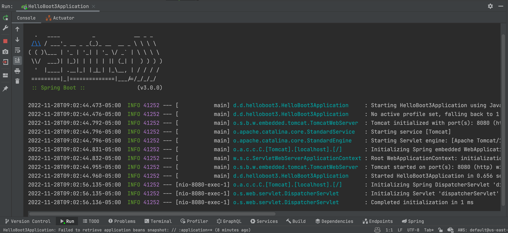

Happy Monday and welcome to another edition of my newsletter. I hope everyone who celebrated Thanksgiving had a great holiday week spent with great food and family. In this week's newsletter, I am going to talk about Spring Boot 3, submitting conference talks, and hitting a big milestone on YouTube.

## Current Status

As I mentioned in the open last week we celebrated Thanksgiving last week. I absolutely love this holiday because it’s all about my favorite things, family, friends, and food. I also turned to my wife during the week with a revelation that is absolutely the longest most stressful week of the whole entire year.

We host a pretty large group every year so I end up taking off of work so we can prepare for that. It takes us all week of running around, preparing food, and getting the house ready for company. All of this while trying to make sure our little ones have a fun week amidst the chaos.

Thanksgiving finally comes around and the whirlwind of family, food and fun is gone way to fast in comparison to the time it took to put together. Then when you finally make it through the day and you have to quickly regroup and turn your attention towards Christmas.

We get all of our decorations from storage and then get the inside decorated along with setting up the tree. The little ones love putting up the tree and hanging the ornaments so we put on some Christmas music and made a morning of it. Finally, I had to get on the roof and hang up all of the outside lights up.

I love Thanksgiving but I am really glad to see the calendar turn and get back to work this week. I have a busy week ahead of me as I am working on a bunch of videos and preparing for a Spring Boot workshop at CodeMash in early January.

## Spring Boot 3

Spring Framework 6 and Spring Boot 3 are now both GA and what an exciting time it is to be a Spring Developer. If you head over to [start.spring.io](http://start.spring.io) and create a new project the default will now be Spring Boot 3 which includes Spring Framework 6 under the hood.

If you need further proof run the project you downloaded and there in plain ASCII art you can see the new version and I don’t know if you know this but ASCII art never lies 😜

If you want to find out more I encourage you to check out the Spring Boot 3 [release notes](https://github.com/spring-projects/spring-boot/wiki/Spring-Boot-3.0-Release-Notes) or [this article](https://spring.io/blog/2022/11/24/spring-boot-3-0-goes-ga) by the Spring Team. This release includes over 5700 commits by 151 individuals. I am excited about so much when it comes to Spring Framework 6 and Spring Boot 3 but here are a few of my favorites.

- Java 17 Baseline - This is exciting to me because so many projects are going to get an instant upgrade in security and performance just by moving to Java 17.
- Jakarta EE 9/10 - Moving from javax → jakarta namespace means we now get to take advantage of an evolving API.
- Support for generating [Native Images](https://docs.spring.io/spring-boot/docs/3.0.0/reference/html/native-image.html#native-image) with GraalVM.
- Improved observability with Micrometer and Micrometer Tracing
- Problem Detail Support
- Declarative HTTP Clients
- Spring Security 6
- Spring Data 2022
- Spring for GraphQL 1.1
- Spring Authorization Server 1.0

I am working on a few videos around Spring Boot 3 and I am just trying to figure out how I want to structure some of this content. You should see at least 1 video get published on my YouTube channel this week. If there is anything you are struggling with when it comes to Spring Framework 6 and Spring Boot 3 please let me know.

## Conferences

I have begun putting together a list of conferences that I would like to submit proposals for next year. To do so I need to put a list of available conferences, locations, dates, and when the Call for Papers (CFP) closes. With that list in place I could take a look at my schedule and decide which conferences I would be able to submit to.

I had some resources that I was using to pull this list together which started with what conferences my team attended last year. After that, I wasn’t sure where I could find up-to-date lists. I am looking for anything in Java, Spring, Web Development, and JavaScript space. I decided to ask Twitter and I got a lot of really great responses

[https://twitter.com/therealdanvega/status/1592246011803897856](https://twitter.com/therealdanvega/status/1592246011803897856)

Here is a collection of links I compiled from those responses.

- [https://dev.java/community/events/](https://dev.java/community/events/)
- [https://github.com/javaconferences/javaconferences.github.io](https://github.com/javaconferences/javaconferences.github.io)
- [https://github.com/scraly/developers-conferences-agenda](https://github.com/scraly/developers-conferences-agenda)
- [https://confs.tech/](https://confs.tech/)
- [https://www.papercall.io/](https://www.papercall.io/)
- [https://twitter.com/TechDailyCFP](https://twitter.com/TechDailyCFP)
- [https://trello.com/b/I263Hm5u/events-for-speakers](https://trello.com/b/I263Hm5u/events-for-speakers)

If you have any lists that I am missing in the Java, JavaScript, Web space please let me know. I put together a list based on those links and I have identified some conferences I will begin submitting to as the Call For Papers opens up. This is still a work in progress but here is a screenshot of that list in Notion.

## 20,000 Subscriber Milestone on YouTube

I hit a huge milestone last week on YouTube passing 20,000 subscribers.

[https://twitter.com/therealdanvega/status/1596340618917076993](https://twitter.com/therealdanvega/status/1596340618917076993)

It’s crazy to me even writing that number after all the work that I have done producing videos over the years. It’s crazy to look back on your career after all this time and see that the signs were there even in the beginning. In 2001 I was doing technical support for a VoIP call center software that was written in Java. I got tired of answering the same questions over and over and decided to put together videos showing customers how to perform common tasks. This might seem as normal as walking these days but back in 2001 YouTube hadn’t even been created yet. I still remember to this day enjoying putting those videos and documentation together to help people. Like I said, the signs were there.

I want to start off by saying thank you to everyone who has supported me and the channel over the years. I appreciate your support and your feedback and you push me every single day to get better. I remember struggling early on in my career to learn new things and it's my hope that through my tutorials something clicks and you are able to learn a new language, framework, product, or skill. I hope you can use these new skills to build something amazing or land that dream job of yours.

I sat down and made a video talking about this huge milestone. In this video, I decided to go back and take a look at some of my earlier videos on the channel and provide some feedback. I hope you enjoy this and I look forward to making a couple more of these at 50,000 and 100,000 🤯

`youtube:https://youtu.be/hsMKOirkLZU`

## Content

- [Spring Office Hours with Daniel Garnier on Spring Security](https://youtu.be/0i6Xu3Pf83Q)
- [Serverless Spring](https://youtu.be/gj1DDymw5iY)

### Upcoming Talks

- [Spring Office Hours with Daniel](https://youtu.be/0i6Xu3Pf83Q)
- [CodeMash 2023](https://www.codemash.org/): Give your APIs a REST & Make the move to GraphQL
- [CodeMash 2023](https://www.codemash.org/): Getting Started with Spring

## Around the Web

### 📝 Articles

- [Introducing Notion AI](https://www.notion.so/blog/introducing-notion-ai)
- [Spring Boot 3 Buildpacks with Testcontainers Cloud](https://dashaun.com/posts/spring-boot-3-buildpacks-with-testcontainers-cloud/)
- [A new builder for Spring Boot 3 RC1 on ARM64](https://dashaun.com/posts/paketo-aarch64-builder-spring-boot-3-rc1/)
- [Twas the night before Spring Boot 3.0 went GA…](https://springbootlearning.medium.com/twas-the-night-before-spring-boot-3-0-went-ga-f0b51c1b0a7b)
- [Going Native With Spring Boot 3 GA](https://betterprogramming.pub/going-native-with-spring-boot-3-ga-4e8d91ab21d3)

### 🎬 Videos

- [6 WAYS to be a SPRING CODER](https://www.youtube.com/watch?v=qaK6N21tbVQ)
- [Spring Tips: the road to Spring Boot 3: Spring Framework 6](https://www.youtube.com/watch?v=aUm5WZjh8RA)
- [Spring Tips: the road to Spring Boot 3: ahead-of-time compilation and GraalVM](https://www.youtube.com/watch?v=TOfYlLjXufw&t=731s)
- [Spring boot 3.0 - The full migration guide](https://www.youtube.com/watch?v=VWdNfvNFXUc)
- [Spring 6 and Problem Details](https://www.youtube.com/watch?v=4YyJUS_7rQE&t=691s)
- [Spring 6 and Declarative Clients](https://www.youtube.com/watch?v=QXgq_e7etXc&t=33s)

### 🎙 Podcasts

- [Java Champion, legendary engineer, and author Trisha Gee](https://bootifulpodcast.fm/#/episodes/3259c661-0524-46dc-805d-2388011030b9)
- [Foojay Podcast #6: Welcome to Foojay!](https://foojay.io/today/foojay-podcast-6/)

### 💻 Projects

- [Polypane](https://polypane.app/)
- [It's here: the all-new Descript, backed by OpenAI Startup Fund](https://www.descript.com/blog/article/all-new-descript-backed-by-openai-startup-fund)
- [Notion AI](https://www.notion.so/ai)

## Until Next Week

I hope you enjoyed this installment of the newsletter and I will talk to you in the next one. I hope you have a great week and as always friends...

Happy Coding 
Dan Vega 
danvega@gmail.com 
[https://www.danvega.dev](https://www.danvega.dev)

