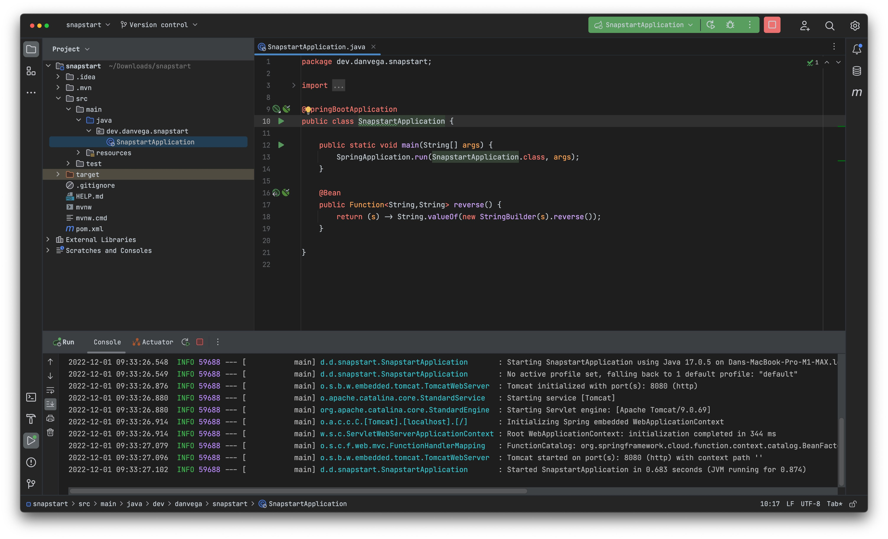
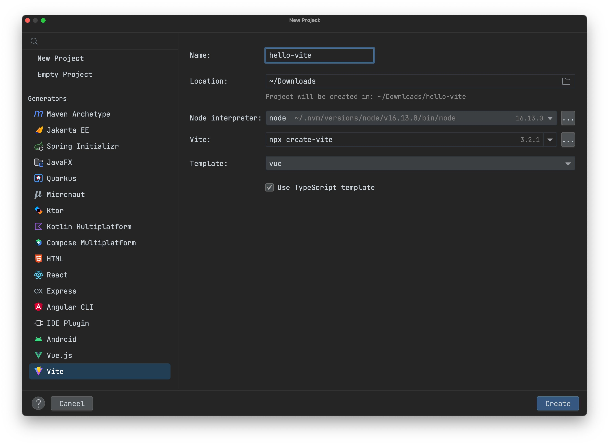

Happy Monday and welcome to another edition of the newsletter. It’s hard to believe that we have crossed into December and that the new year is right around the corner. Today I would like to talk to you about AWS SnapStart, Spring Security 6, and IntelliJ 2022.3

## AWS SnapStart

Last week was Amazon’s big conference [re:Invent 2022](https://reinvent.awsevents.com/) which took place in Las Vegas. There were a ton of really exciting announcements that came out of the conference but for me, Lambda SnapStart really got my attention. What is AWS Lambda SnapStart you ask?

> [AWS Lambda SnapStart](https://docs.aws.amazon.com/lambda/latest/dg/snapstart.html) is a new performance optimization developed by AWS that can significantly improve the startup time for applications. Announced at [AWS re:Invent](https://reinvent.awsevents.com/)
>  2022, the first capability to feature SnapStart is Lambda SnapStart for Java. This feature delivers up to 10x faster function startup times for latency-sensitive Java applications at no extra cost, and with minimal or no code changes.

This is huge because one of the only problems with writing serverless functions in Java is the cold start times. Each subsequent request of the function is never really an issue so this promise of up to 10x faster is huge. This is currently only supported for Java and is available in certain regions.

The one limitation is that currently it only supports Java 11 (Corretto) so you won’t be able to use Spring Boot 3 because that requires a baseline of Java 17. I did reach out to someone and they said they are working on support for Java 17 in Lambda but it isn’t available at this time.

I decided to give this a try with plain old Java at first and it worked out really great. It is easy to enable and I could see the performance improvements right away. I created a [YouTube short](https://www.youtube.com/shorts/L2oJ-nL-Zfk) talking about how to enable this in your Lambda Function.

After that, I wanted to see what this meant for Spring developers. I decided to create a new Spring Boot project using 2.7.6 and Java 11 with Spring Web and Spring Cloud Function. If you’re new to [Spring Cloud Function](https://spring.io/projects/spring-cloud-function) it allows you to use a uniform programming model across serverless providers, as well as the ability to run standalone (locally or in a PaaS).

I created a very simple function that takes in a String and reverses it. While this was a trivial example it allowed me to see that the performance improvements were HUGE for Spring developers. The initial cold start time for my function before enabling SnapStart was almost 5 seconds and 312 ms after enabling it. I decided to create a video on this which you can check out below.

`youtube:https://www.youtu.be/isS6m6aj_Ak`

## Spring Security 6

With the release of Spring Boot 3 comes the shiny and new Spring Security 6. There are a number of breaking changes in this version that include some deprecations that have been removed. If you want to learn more about these changes you can read through the [documentation](https://docs.spring.io/spring-security/reference/whats-new.html). If you are updating your Spring Boot projects from 2.7.x to 3 and you use Spring Security these are changes that you will need to take a look at. I decided to pick out 3 of those changes and create a tutorial on them.

`youtube:https://www.youtu.be/TDOHbK39Oxg`

## IntelliJ 2022.3

If you follow me you know that I am a huge fan of IntelliJ. They just released a new version of IntelliJ IDEA and it comes packed with some really great features. If you want to learn more about it you can check out the [release notes](https://blog.jetbrains.com/idea/2022/11/intellij-idea-2022-3/).

There were 3 changes that really stood out for me. First was the new UI that you can enable by going into Settings > Appearance & Behavior > New UI and enabling the new UI. My initial thoughts on the UI are WOW 🤩 I love the new look, icons shiny buttons at the top. I also go asked about my new setup a lot and I am using the new UI with the GitHub Dark (Experimental) theme.

As a Spring Developer, I really love the new feature that allows you to add a dependency to the class you’re working on. To show off this feature I created a quick short-form video and posted it to Twitter.

[https://twitter.com/therealdanvega/status/1598421479846285314](https://twitter.com/therealdanvega/status/1598421479846285314)

Finally, I am a big fan of Vue and Vite. You can now create a new Vite project right within IntelliJ using the new project generator

## Content

- [Spring Framework 6 Trailing Slash Changes #shorts](https://www.youtube.com/shorts/C_njlumpFc4)
- [AWS Lambda SnapStart for Java #shorts](https://www.youtube.com/shorts/L2oJ-nL-Zfk)
- [What’s new in Spring Security 6](https://www.youtube.com/watch?v=TDOHbK39Oxg)
- [AWS Lambda SnapStart for Spring Developers](https://www.youtube.com/watch?v=isS6m6aj_Ak)

### Upcoming Talks

- [CodeMash 2023: Getting Started with Spring](https://www.codemash.org/session-details/?id=380331) (Workshop)
- [CodeMash 2023: Give your APIs a REST & Make the move to GraphQL](https://www.codemash.org/session-details/?id=380324)

## Around the Web

### 📝 Articles

- [What's new in Spring?](https://maciejwalkowiak.com/blog/whats-new-in-spring/)
- [Two million Java developers on Visual Studio Code! November 2022 Update](https://devblogs.microsoft.com/java/two-million-java-developers-on-visual-studio-code-november-2022-update/)
- [My first JavaFX application](https://medium.com/javarevisited/my-first-javafx-application-ee70a1d48cb3)
- [New – Accelerate Your Lambda Functions with Lambda SnapStart](https://aws.amazon.com/de/blogs/aws/new-accelerate-your-lambda-functions-with-lambda-snapstart/)
- [Speed Your Spring Boot 3.0 Migration](https://www.moderne.io/blog/speed-your-spring-boot-3-0-migration)

### 🎬 Videos

- [Why Container Queries Will Revolutionize Responsive Web Dev](https://www.youtube.com/watch?v=ypN-Uwshc5M)
- [https://www.youtube.com/watch?v=AgxvrZLI1mc](https://www.youtube.com/watch?v=AgxvrZLI1mc)

### 🎙 Podcasts

- [Between Chair and Keyboard with Ekaterina Novoseltseva](https://www.youtube.com/watch?v=WP0063oIyJ0)
- [What is GraalVM? What is Spring Native? And why do you need native Java?](https://www.tanzutalk.com/e/what-is-graavm-what-is-spring-native-and-why-do-you-need-native-java/)
- [Huberman Lab - Dr. Lex Fridman: Navigating Conflict, Finding Purpose & Maintaining Drive](https://hubermanlab.com/dr-lex-fridman-navigating-conflict-finding-purpose-and-maintaining-drive/)

## Until Next Week

I hope you enjoyed this installment of the newsletter and I will talk to you in the next one. If you have any links you would like me to include please [contact me](http://twitter.com/therealdanvega) and I might add them to a future newsletter. I hope you have a great week and as always friends...

Happy Coding 
Dan Vega 
danvega@gmail.com 
[https://www.danvega.dev](https://www.danvega.dev)

