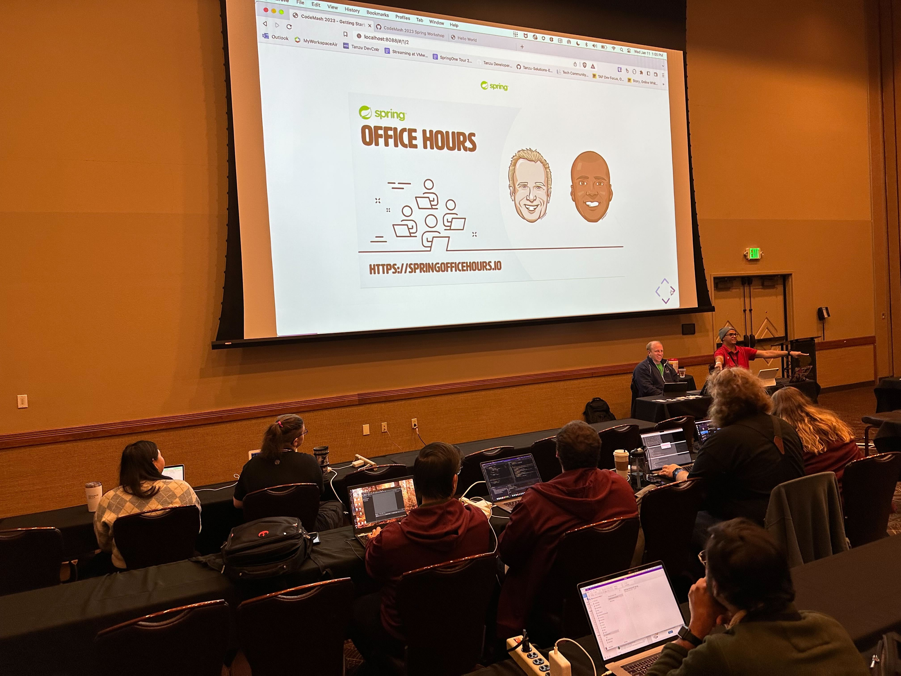
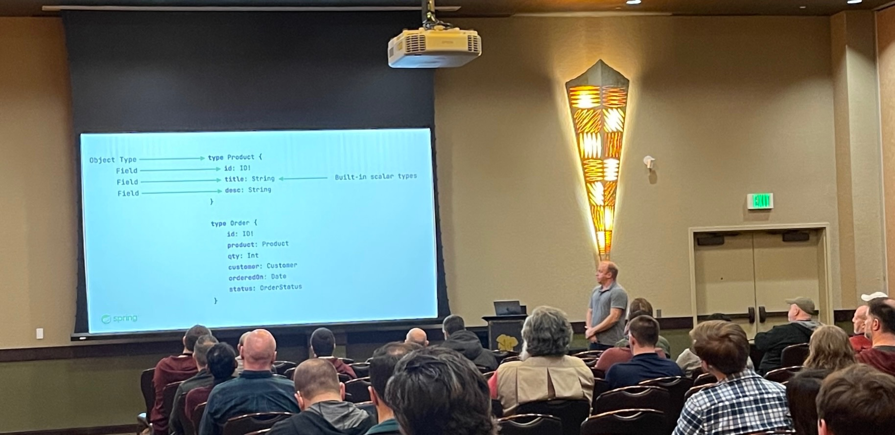
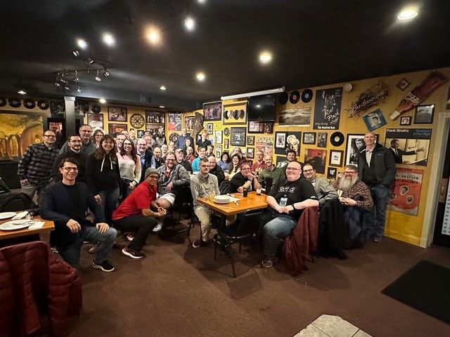
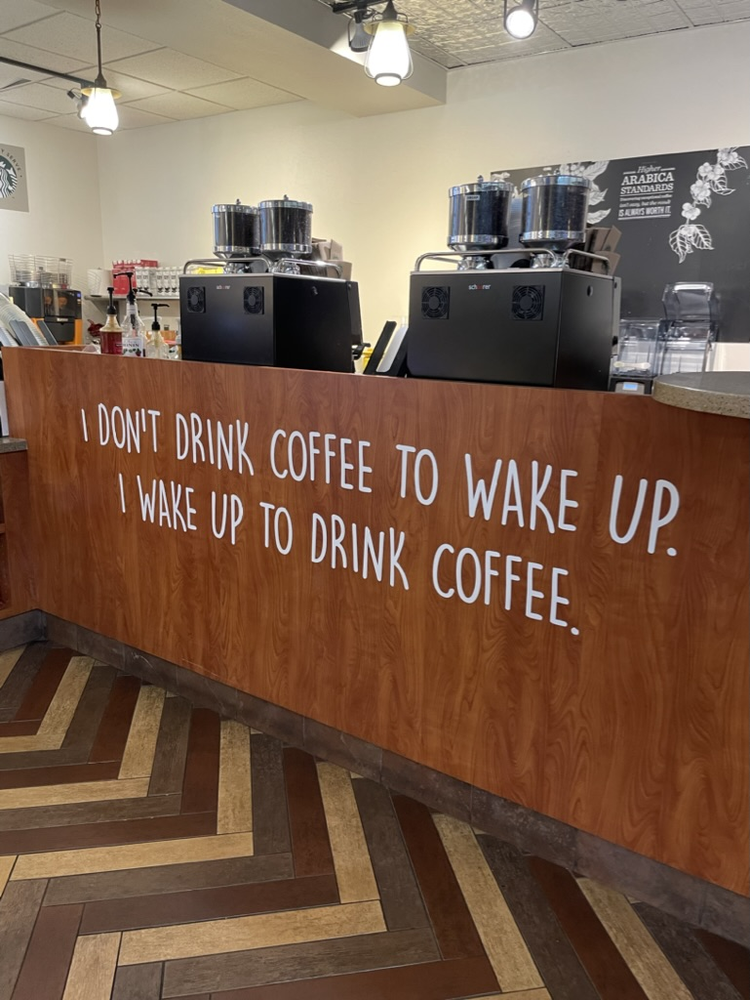

Happy Monday and welcome to another edition of the newsletter. This week I want to talk to you about my week in Sandusky Ohio for CodeMash 2023 and an upcoming presentation at the Cleveland Java User Group. I always feel so refreshed and excited to get back to work after a conference and this week is no different.

I’m glad to be back home and in my office before a short trip to San Francisco next week for a [SpringOne Essentials Watch Party](https://connect.tanzu.vmware.com/SpringOne-Essentials-Watch-Parties-2023.html). That’s right SpringOne has moved to an online experience to bring together the Spring Community. This is a virtual event that is taking place January 24-26 and you can [register for free](https://springone.io/).

## CodeMash

[CodeMash](https://www.codemash.org/) is an annual developer conference that takes place in Sandusky Ohio and is attended by thousands of developers from all over the world. This year's conference featured a variety of talks and workshops on various topics related to software development.

This was my 2nd time attending and speaking at the conference and like the 1st it didn’t disappoint. I remember my [first CodeMash](https://www.danvega.dev/blog/2020/01/13/codemash-2020-recap/) very well because it took place in January of 2020. This would be the last conference and public event of any kind for me because shortly after the pandemic happened and we were locked indoors for the next 2 years.

This year's event was pretty special because I had a few of my teammates there with me. I was able to bring my family and our daughter Juliana who is 2 now wasn’t at the last one. The whole family loves going to Kalahari and it's a great way to break up the miserable cold weather that takes place in Cleveland in January.

I honestly didn’t have a ton of time to attend many sessions because I was busy with my own talks so I will give you a quick rundown of those.

### Spring Workshop

My coworker DaShaun and I gave a 4-hour Introduction to Spring workshop. Overall I thought it went pretty well but this was the first time we gave this one and we learned a few things from it that we will take into the next one. Thank you to our coworker Whitney for grabbing this 📸

When you go into a workshop you think that 4 hours is a long time and it turns out that it's never enough time. We knew going in that we couldn’t cover everything but we were still pretty ambitious with what we did want to cover. This was the agenda that we ended up going through:

- Introduction
- Getting Started with Spring
- Core Features and Fundamentals
- Spring MVC
- Data
- Production

I hope we get the chance to give this workshop again so if you’re interested in us doing so please feel free to reach out to me.

### GraphQL Talk

Next up was my solo talk titled “Give your APIs a REST and make the move to GraphQL”. This talk was an introduction to GraphQL in Java using Spring for GraphQL but a lot of the content was applicable to anyone getting started with it.

The room was packed out and it was great to see some familiar faces in the crowd. It was also my first time testing out my new [Logitech Spotlight pointer](https://amzn.to/3IRkCrw) (thanks Nate) and I have to say that it worked out great!

This presentation was a mix of slides and live coding and the pacing took me right up to my allotted time of 1 hour. The crowd was amazing and asked some really great questions during the presentation. I had to jot a couple of them down because they were really good and I need to get some answers to them. A huge Thank you to [Todd](https://twitter.com/toddlibby/status/1613604500203532288) for shaping this 📸 during my talk.

### Speaker Dinner

There is no official speaker dinner at CodeMash but since the beginning of time, Chris Judd and his company, Manifest Solutions have held a dinner down the street at Danny Boys. This was a chance to eat some good pizza and hang out with some really bright people. It’s really hard to grab people for meaningful conversations in a crowd of 2,000+ attendees at the conference so this setting did just that. Huge shoutout to Chris Judd and Manifest for putting this on!

## Cleveland Java User Group

If you weren’t able to attend my talk at CodeMash I will be giving it to the Cleveland Java User Group this Tuesday, January 17th at 5:30 PM. If you want to learn what GraphQL is and why you might want to reach for it in your next Java application please consider checking this out. There will be free pizza and really great group of people to hang out with.

[https://www.meetup.com/cleveland-java/events/290716282/](https://www.meetup.com/cleveland-java/events/290716282/)

## Around the web

### 📝 Articles

I really enjoyed this article on [Getting Started with Java Development in 2023](https://www.notion.so/CodeMash-2023-9cd7c45af51e49599259039500526505) by Java Champion Gunnar Morling. The idea for this blog post is to provide an opinionated guide for folks getting started with Java development in 2023, helping you with your very first steps with that amazing platform.

### 📚 Books

I had a chance to start reading [Greg Turnquist’s new book Learning Spring Boot 3.0](https://amzn.to/3H52uJi) and so far I am really enjoying it. It’s not just another dump of every single thing you need to learn in Spring which can be overwhelming. Instead, he offers a practical set of information to get you up and running with Spring. I was reading this on my iPad but I just got the physical copy and will switch over to that as soon as I can get back to it.

At the same time, I am currently reading [Can’t hurt me by David Goggins](https://amzn.to/3iBJrgn). David has led an interesting life and his story is inspiring, to say the least. What I really love about this book is his message that we are all leaving so much potential on the table. The conversations about mindset have me waking up every morning ready to run through a brick wall.

### ✍️ Quote of the week

“I don’t drink coffee to wake up. I wake up to drink coffee.” ― Starbucks at Kalahari 🤣

## Until Next Week

I hope you enjoyed this installment of the newsletter and I will talk to you in the next one. If you have any links you would like me to include please [contact me](http://twitter.com/therealdanvega) and I might add them to a future newsletter. I hope you have a great week and as always friends...

Happy Coding 
Dan Vega 
danvega@gmail.com 
[https://www.danvega.dev](https://www.danvega.dev)

