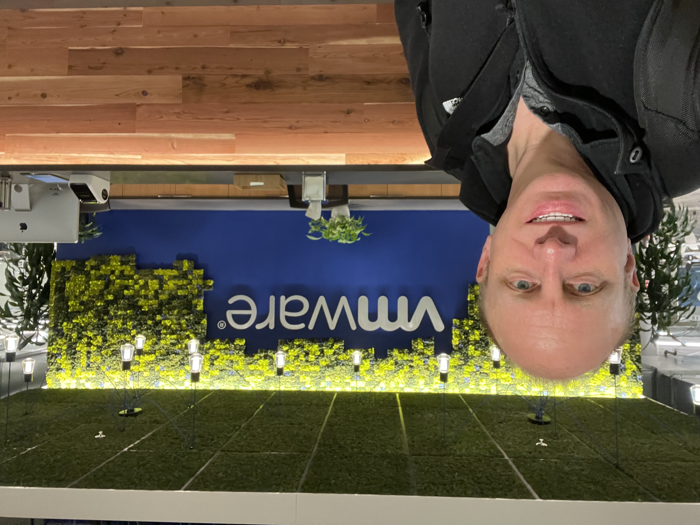
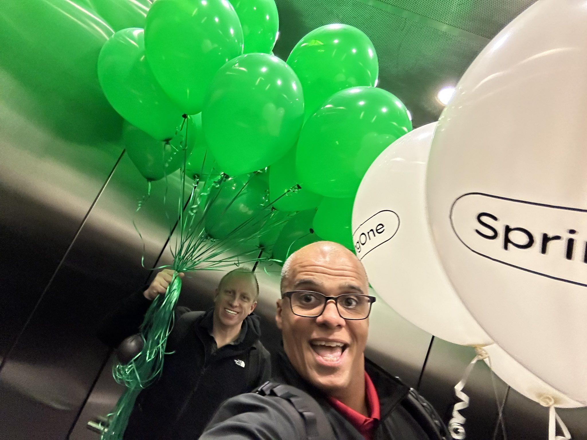
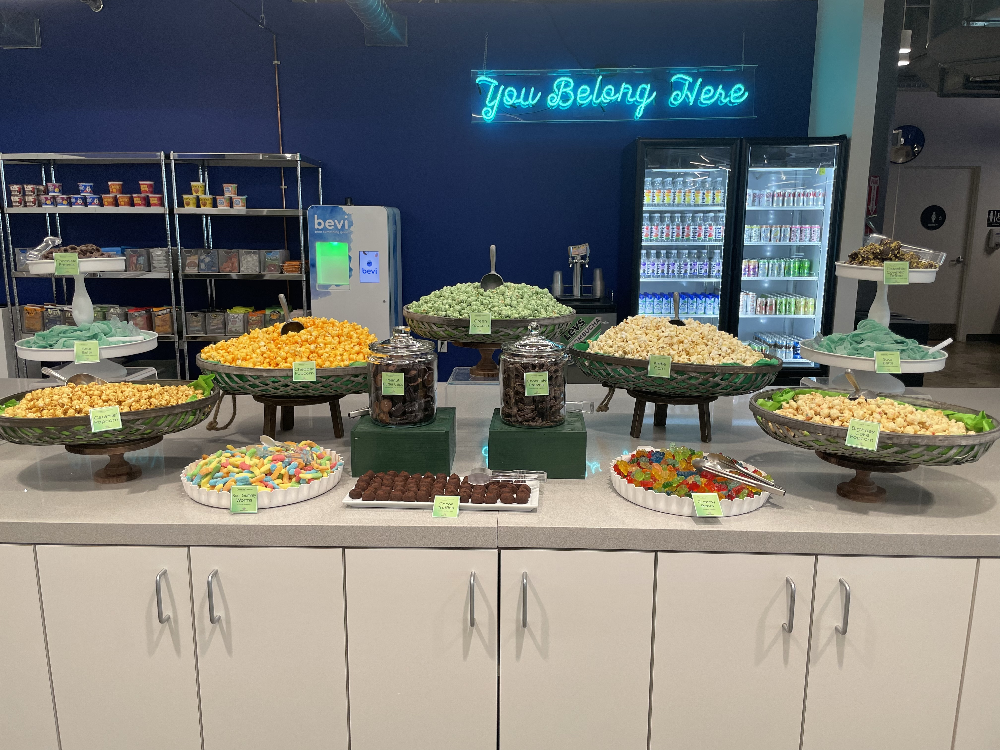
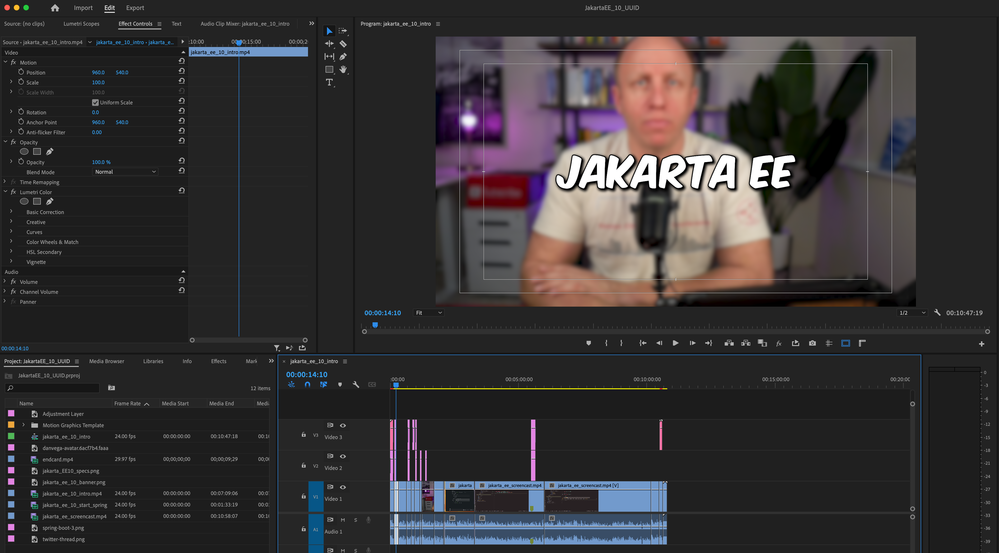
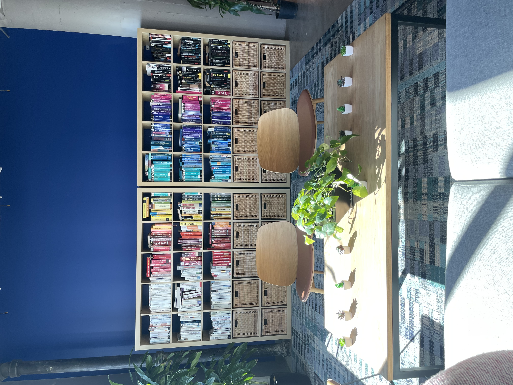

Happy Monday and welcome to another edition of the newsletter! Last week, I had the opportunity to attend the [SpringOne Essentials](https://springone.io/) virtual conference in San Francisco. Today, I'd like to share with you some of the announcements made during the event. I also want to tell you about a new video I made last week as well as what I will be working on in the near future. With only one day left in January, we are getting ever closer to the eventual end of winter and that makes me smile.

## SpringOne Essentials

I was able to make the trip out to San Francisco for our virtual event called [SpringOne Essentials](https://springone.io/). This is the event that replaced SpringOne last year which we, unfortunately, had to cancel. It was a great few days and I really enjoyed the energy I get from being back in the office around people.

DaShaun and I were there to watch the day 1 event and then give a presentation on What’s new in Spring Framework 6 and Spring Boot 3. I thought it was packed full of some really great presentations along with some awesome announcements. I really enjoyed our in-person presentation and I thought we got some really great questions from everyone in attendance.

The release of Spring Framework 6, Spring Boot 3, and all its accompanying features was the talk of the town. I really enjoyed Juergen Hoeller's comprehensive overview of what to expect with this new release and beyond. I also enjoyed the fact that everyone can get their hands on the [State of Spring 2022](https://tanzu.vmware.com/content/ebooks/the-state-of-spring-2022) report. This report is packed full of information on what developers are doing with Spring and how they feel about the current state of the framework. If you want to hear some more insights into this you can join us for [Spring Office Hours](https://tanzu.vmware.com/developer/tv/spring-office-hours/) on Tuesday as we take a deep dive into the report.

We also announced the launch of [Spring Academy](https://tanzu.vmware.com/content/blog/introducing-spring-academy). This is a valuable new resource to help developers of all levels improve their skills with Spring. Spring Academy provides an accessible way to start learning Spring and to grow skills with Spring at every level of your career as a developer. Created and curated by the Spring team, the foremost experts on all things Spring, Spring Academy delivers on-demand training so you can invest in yourself and your understanding of the latest developments in the Spring ecosystem.

Finally, my colleague Rita Manachi has put together a great roundup of all the exciting announcements from SpringOne Essentials. Check it out [here](https://tanzu.vmware.com/content/blog/springone-essentials-2023-news).

I also just want to point out that it was great to be in San Francisco with my friend DaShaun. We got to have a couple of really great dinners together, we went on a nice run down by the pier and we even caught the new Avatar movie on a 3D IMAX screen which was incredible. I guess what I am trying to say is it’s really great working with people you love to be around and I highly recommend it 🥳

## Jakarta EE 10 in Spring Framework 6

As I was waiting to board my plane in San Francisco on Wednesday I decided to send out a tweet about Jakarta EE 10 support in Spring Boot 3 and how you can use a UUID as an auto-generated primary key. Little did I know that this last-minute tweet would garner so much attention 🤩

[https://twitter.com/therealdanvega/status/1618310057699213314](https://twitter.com/therealdanvega/status/1618310057699213314)

With a strong interest in the subject, I moved this video to the top of my queue and worked on it towards the end of the week. I also wrote an accompanying [blog post](https://www.danvega.dev/blog/2023/01/27/jakarta-ee-10-uuid/), if you'd like to read it.

To stay true to my goal of creating better content, I followed my own advice and focused on improving one aspect of the video. I wanted to learn when and where to use adjustment layers. Adjustment layers are an excellent way to apply effects to only a part of a clip, without affecting the entire clip. You could split the clip and add effects directly, but the effects would be limited to that clip. The great thing about adjustment layers is that they can be reused in the future.

I added an adjustment layer to this video to blur it and bring some text to the foreground, to draw the viewer's attention. It's not the most thrilling thing, but I'm gaining new skills to help me tell stories more effectively.

In this tutorial, I demonstrated how to use the new UUID generator type in a Spring Data JPA application. It's exciting to start taking advantage of the new features available in Jakarta.

[https://www.youtube.com/watch?v=ZWwqcH\_\_kr4](https://www.youtube.com/watch?v=ZWwqcH__kr4)

## Upcoming Content

My schedule is actually pretty clear all things considered for the next couple of months. The next conference I have on the schedule is Devnexus which takes place April 4-6 in Atlanta. I’m looking forward to presenting on Spring Recipes with my friend Nate Schutta.

I’m also going to be sitting down to record an episode of the [Java Pub House](https://www.javapubhouse.com/) this week. We are going to talk about all things Spring Framework 6 and Spring Boot 3 and I am really looking forward to that. I am not sure when that will come out but I will be sure to let you know.

Other than that, I will be working on YouTube videos and have a large queue of videos to create. I'm also considering becoming a course creator again. I have three courses in mind and will likely start talking about them soon. The big question is where to publish them. I don't have an answer yet, but I'm leaning toward Udemy since I already have an audience there. I was waiting for YouTube to launch its course platform in the US, but that hasn't happened yet.

## Around the web

### 📚 Books

I started reading [SuperIntelligence](https://amzn.to/3WP7whD) by Nick Bostrom on my way out to San Francisco and I’m almost done with it. This book is an exploration of the potential consequences of creating machines that are more intelligent than humans. This was an eye-opening book that examined the likely outcomes of a world where machines can think faster and more accurately than humans and the ethical implications of such a world.

While we are on the subject of books I saw this cheerful, color-coordinated bookshelf at the VMware office in San Francisco. Few things bring me more joy than a well-organized book collection 🤩

### 🎙 Podcasts

I really enjoyed [this AWS podcast](https://aws.amazon.com/podcasts/567-introducing-aws-lambda-snapstart/) with Mark Sailes on AWS Lambda SnapStart. I did a [video](https://youtu.be/isS6m6aj_Ak) on AWS Lambda SnapStart for Spring Developers and I am really impressed with the technology. It was really great to hear a detailed explanation of the product and some of the edge cases you need to look out for.

### ✍️ Quote of the week

“This is quite possibly the most important and most daunting challenge humanity has ever faced. And—whether we succeed or fail—it is probably the last challenge we will ever face.” - Nick Bostrom

## Until Next Week

I hope you enjoyed this newsletter installment, and I will talk to you in the next one. If you have any links you would like me to include please [contact me](http://twitter.com/therealdanvega) and I might add them to a future newsletter. I hope you have a great week and as always friends...

Happy Coding 
Dan Vega 
danvega@gmail.com 
[https://www.danvega.dev](https://www.danvega.dev)

