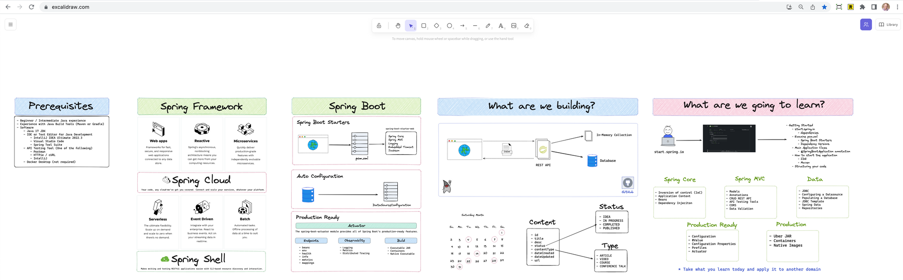
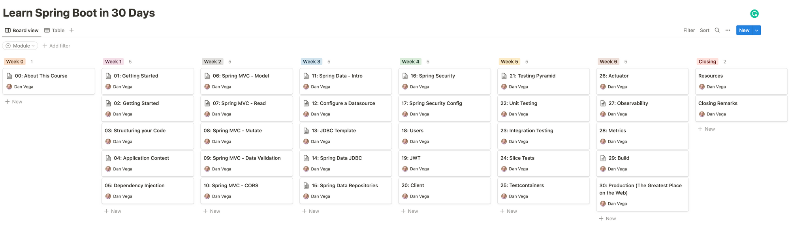

Happy Monday and welcome to another edition of my newsletter. In today’s episode, I want to tell you all about the Spring Boot Crash Course I published last week. I also want to answer the question “Can Chat GPT write a Spring Boot application”? Finally, I will wrap up today’s newsletter with some YouTube news.

## Spring Boot Crash Course

This is a video that I have wanted to put together for a long time now. This introduction to Spring will teach you how to build a REST API using Spring Boot 3 and deploy it to production. This video ended up coming in under 4 hours and I am really happy with how it turned out.

I think I have talked about almost everything in this video in other videos but I wanted a single video where someone new to Spring could get up and running quickly. I start out by defining the prerequisites for this crash course, defining what The Spring Framework is and where Spring Boot fits in. Finally, we discuss what you will build in this course and what you will learn.

`youtube:https://youtu.be/UgX5lgv4uVM`

While this was a lot of fun to put together and I think a lot of people are going to get some value out of it I’m glad I am done with that. Creating a 4-minute video for YouTube is a lot of work so you can only imagine how much work goes into creating a 4-hour video. You have to plan for hours of waiting for tasks like exporting, uploading, and processing time.

The video had something like 3000 views in the first 24 hours which is just amazing but I have a feeling it’s going to blow up over the next month or so 🤞🏻 If you found value in this please feel free to drop me some feedback.

With that done I will start recording a complete course that will include testing & security and go more in-depth into a few topics. This will be a paid course but should be pretty affordable for most. If this is something you’re interested in please let me know.

## Chat GPT & Spring Boot

I released another video last week where I set out to answer the question “Can Chat GPT create a Spring Boot Application?”. This was a lot of fun to work on and if you have been following this newsletter you know I am a big fan of AI and Chat GPT.

`youtube:https://youtu.be/CXbXoMIVpRg`

I started off this experiment by asking Chat GPT for a list of high-level steps needed to write a REST API in Spring Boot. For the most part, it did a really great job of giving us an outline of what we needed to do to accomplish that task. As I stated in the video I think Chat GPT is really good at 3 things when it comes to code:

1. Providing an outline on how to solve a particular problem.
2. Writing specific code when given the proper details.
3. Explaining a certain block of code.

In the end, you still need to understand Java and Spring but I thought it did an excellent job of helping us write our application. There were many times when my knowledge helped me correct some things and I think that was a big takeaway for me. It’s not going to replace developers but it is a valuable tool that you should have in your toolbox.

## YouTube

Towards the end of last year, I crossed a pretty big milestone on YouTube when I hit 20,000 subscribers. Last week I crossed 25,000 and I want to thank all of you for your support. In particular, the Java and Spring community has shown me so much love over the last year and I’m very thankful 🙏

Speaking of YouTube I hired 2 editors from Upwork a couple of weeks ago and I wanted to let you know how that little experiment was going. This is coming out of my pocket so I don’t have much of a budget for this. I ended up using Chat GPT to craft a job description and I soon had a number of great candidates.

The first editor was really responsive and while he did a good job I just felt like it wasn’t providing a ton of value. These were edits that I could have made and they honestly took him about 2x as long as they would have taken me.

The 2nd editor provided me with a 1st cut of the video on a service called [frame.io](http://frame.io) where I was able to watch it and leave comments with timestamps. I never heard of this service and I thought it was a wonderful way to provide feedback during the editing process. The only problem was he absolutely nailed the video and I only had 1 small comment. He is the one that did the Chat GPT & Spring Boot video I talked about above.

I have a ton of work I would like to give this person but again it comes back to budgeting. This is why I want to put together some paid courses so that I can feed that money back into the video creation process. Also if you or your business is interested in sponsoring an upcoming video please feel free to reach out. I’m 25,000 subscribers in and have yet to take any brand deals on my channel.

## AI

I’m a big fan of [Midjourney](https://midjourney.com/) and recently signed up for a monthly membership that gets me access to 200 images a month and faster response times. I’m still learning how to craft good prompts to get the desired outcomes but so far it's really impressive. Here are 2 images I was experimenting with this week.

A **person reading a book RGB --ar 16:9 --stylize 100 --s 5000**

L**as Vegas if it were taken over by zombies**

## Around the web

### 🎙 Podcasts

I was recently on the [Java PubHouse](https://www.notion.so/momoir-com-a10c4d2dc1494cd0a68be2121cdc4b93) podcast with Freddy and Bob and we talked all about Spring Boot 3. This was a really fun conversation and I’m really looking forward to meeting both of them at Devnexus in April.

### 🎬 Videos

I really enjoyed this video [Demystifying Spring Internals](https://www.youtube.com/watch?v=LeoCh7VK9cg) by Madhura Bhave who is an Engineer on the Spring team. She did an excellent job revealing some of the things that occur in your Spring application that you may not be aware of.

### 🐦 Tweet

I had some free time (a whole hour) on Saturday night so I did what any self-respecting programmer would do. I decided to dive in and learn a completely new language and wrote my first Rust application.

[https://twitter.com/therealdanvega/status/1627122138850246656](https://twitter.com/therealdanvega/status/1627122138850246656)

## Until Next Week

I hope you enjoyed this newsletter installment, and I will talk to you in the next one. If you have any links you would like me to include please [contact me](http://twitter.com/therealdanvega) and I might add them to a future newsletter. I hope you have a great week and as always friends...

Happy Coding 
Dan Vega 
danvega@gmail.com 
[https://www.danvega.dev](https://www.danvega.dev)

