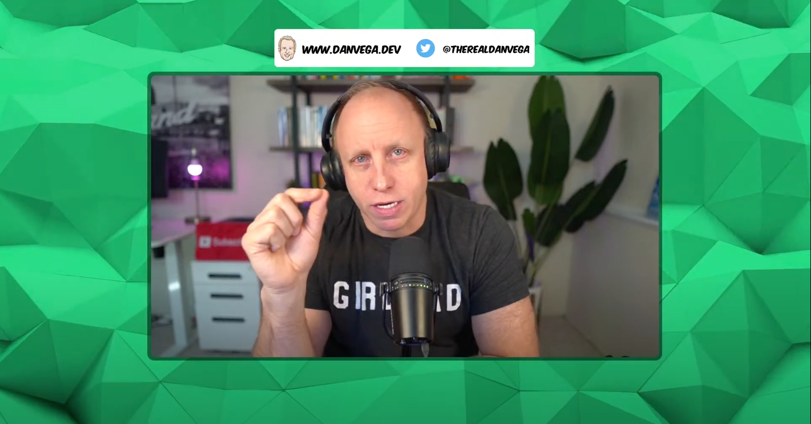
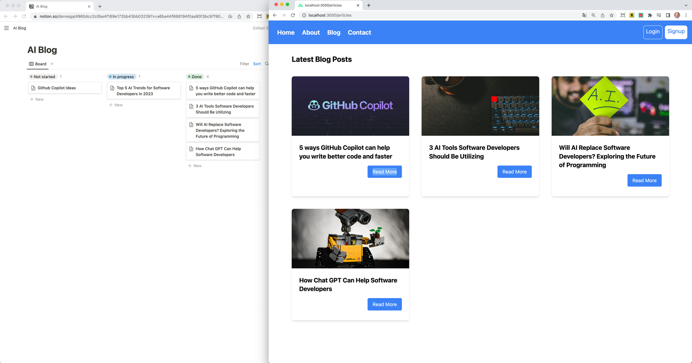

Welcome to another edition of the newsletter! First, I want to congratulate anyone who lives in a cold-weather area for making it through the worst part of winter. March is officially here! Today I want to talk to you about Live Streaming, Spring Shell, and Nuxt 3.

## Live Streaming

If you’re a regular around here you know that I host a show every week with my friend DaShaun called Spring Office Hours. That show is so much fun and I look forward to it every single week. There is some level of planning that goes into that show and we don’t have the chance to do a ton of live coding on that show.

Recently, I made the decision to incorporate live coding into my regular routine. The idea had been on my mind for the last couple of weeks and I was excited to try it out. For my streaming software, I'm using [Ecamm Live](https://www.ecamm.com/mac/ecammlive/), which is different from the software I use on Spring Office Hours. I knew it would take a few episodes to get used to, but I finally feel like I have a handle on it.

It can get lonely working at home in my dungeon (I work out of the basement) so it’s been a lot of fun connecting with you. I want to thank everyone for joining me during my live streams including Simon, Thomas, and Pad 5 who have been amazing supporters. I was able to go live 5 times over the last 2 weeks and if you missed them you can check out the replays below.

- [Spring Office Hours - Video Editing](https://youtube.com/live/uQDa5eNUSyo?feature=share)
- [Introduction to Spring Shell (Part 1)](https://youtube.com/live/FDRfg77MJsk?feature=share)
- [Introduction to Spring Shell (Part 2)](https://youtube.com/live/1xuTqgilNzM?feature=share)
- [Introduction to Spring Shell (Part 3)](https://youtube.com/live/E84E7c7IlAQ?feature=share)
- [Introduction to Spring Shell (Part 4)](https://youtube.com/live/e8wEcemxcfI?feature=share)

My plan is to use these live streams as an opportunity to share some insight into what I am working on next. I have plans for a few live streams this week, but I need to find time in my schedule for them. If you want to be notified when I go live, please make sure you are subscribed to my [YouTube Channel](https://www.youtube.com/@danvega).

## Spring Shell Introduction

During those live streams, I worked on the demo that I would ultimately use in my Introduction to Spring Shell. Spring Shell is a great project in the Spring ecosystem that enables you to build command-line applications using the same language, framework, and tools that you use every day.

This tutorial will teach you the basics of Spring Shell by guiding you through the creation of a simple dad joke CLI. You can run this CLI right from your command line whenever you need a good laugh.

`youtube:https://youtu.be/8B0IjOIzicU`

## Nuxt 3

I had a great time playing around with Nuxt 3 over the weekend and I'm excited to explore it further. Currently, I have two projects that I'm working on with Nuxt 3. One of them involves moving my website over to Nuxt 3, which I've been planning to do for a while now.

The other is a blog that is driven by a content management system. This isn’t just any CMS though, it’s using Notion. I entertained the idea of moving the content in Notion over to a headless CMS but that just seemed like a bunch of work with no gain.

The author of this blog enjoys writing in Notion so I figured I would just keep it all there. This doesn’t come without its challenges though. A notion page is not simply a dump of content. It’s a highly customizable structure of data so reading data from the API and reconstructing a page back on the nuxt side was a challenge.

Here is a screenshot of a new blog I started in Notion on the left and the Nuxt 3 application displaying those posts on the right. Notice that only the blog posts in the Done column are being displayed. I have a lot more to share on this front including pulling some similar functionality into Spring Boot so stay tuned!

What I am still working out is how this will perform in production. There will probably be 1-2 new posts a week so this could almost be a statically generated site. I’m trying to understand all of the different build modes Nuxt 3 comes with to make the right choice here. I also need to figure out if I can use something like Nuxt Image with images that are hosted on Notion (AWS S3 Buckets).

## Around the web

### 📝 Articles

I enjoyed reading this article by Mark Thomas on [Web Applications and Project Loom](https://spring.io/blog/2023/02/27/web-applications-and-project-loom). The article explains what Project Loom is and how it could benefit Spring developers. By switching to a virtual thread-based executor, web applications that currently use classic Spring MVC should see some scalability improvements.

### 🎙 Podcasts

I enjoyed listening to two podcasts from a recent episode of the Bootiful Podcast. Josh has started live-streaming the recording of the podcast, which I think is a wonderful addition. In the latest episode, Josh interviewed [Glenn Renfro](https://spring.io/blog/2023/02/23/a-bootiful-podcast-its-glenn-renfro-listen-to-this-episode-if-you-want-to) and [Oleg Zhurakousky](https://spring.io/blog/2023/03/02/a-bootiful-podcast-spring-cloud-stream-and-spring-cloud-function-lead-oleg), two amazing members of the Spring Team.

### 🎬 Videos

I really enjoyed this video on [How to Best Use Java Records as DTOs in Spring Boot 3](https://www.youtube.com/watch?v=uy6iN0d6J8E) from Yugabyte. I don’t think I ever knew that you could use a Query and cast the result to a class so I learned something new this weekend!

### 🐦 Tweet

I was excited to see a tweet from Mark Sailes about the AWS Lambda team launching a preview of the Java 17 base container image. Although it's not yet production-ready, this development brings us one step closer to using Java 17 on AWS Lambda, and that makes me very happy!

[https://twitter.com/MarkSailes3/status/1630654777276215296](https://twitter.com/MarkSailes3/status/1630654777276215296)

## Until Next Week

I hope you enjoyed this newsletter installment, and I will talk to you in the next one. If you have any links you would like me to include please [contact me](http://twitter.com/therealdanvega) and I might add them to a future newsletter. I hope you have a great week and as always friends...

Happy Coding 
Dan Vega 
danvega@gmail.com 
[https://www.danvega.dev](https://www.danvega.dev)

