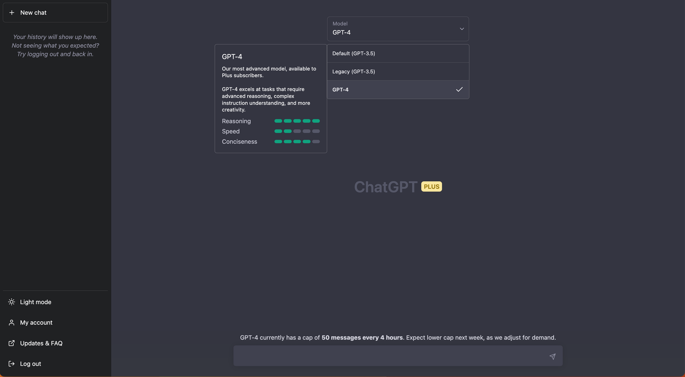
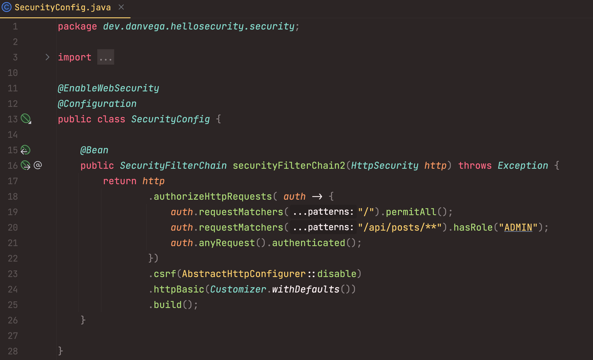

Welcome to another edition of "Dan tells you what he's been up to lately"! This week's big news was the release of GPT-4, and I was excited to explore the new features of this tool, which plays a significant role in my daily workflow.

GPT-4 is a state-of-the-art language model developed by OpenAI. It is an advanced version of its predecessor, GPT-3, designed to improve performance in natural language understanding and generation tasks. Key features of GPT-4 include its large scale, better training data, and improvements in model architecture. These enhancements contribute to its superior capabilities for generating human-like text, answering questions, and completing a wide range of tasks.

In case you were wondering I asked Chat GPT-4 to summarize [this article](https://openai.com/research/gpt-4) and it gave me the previous paragraph. If you’re a ChatGPT Plus user you will be able to select GPT-4 and it’s currently capped at 50 messages every 4 hours.

In my opinion, the biggest highlights of this model are that it now supports multiple inputs and can process images, which opens up a whole new set of possibilities. Additionally, it can handle larger datasets as input, and although it runs slightly slower than GPT-3, I have found the results to be more accurate. The model training data is also supposed to be better, but a downside is that it still only goes up until September 2021.

## What I’m working on…

### Spring Security Lambda DSL

This week I worked on YouTube Tutorial that explained what the Spring Security Lambda DSL was. I would often post Spring Security configuration that looked like the screenshot below and I would get questions about the syntax of that configuration.

If you’re confused about what this syntax is or why it was introduced please check out [this video](https://youtu.be/PWnEZh_t0WI).

### Spring Boot 3.0.4

In a [recent episode](https://youtube.com/live/eRMbHR5LnOc?feature=share) of [Spring Office Hours](http://www.springofficehours.io) DaShaun and I took a look at the recently released [Spring Boot 3.0.4](https://spring.io/blog/2023/03/03/spring-boot-3-0-4-available-now). The reason we wanted to highlight this release is because of a regression that was found. This issue caused problems with Spring applications located in directories with spaces. In these cases, the creation of all `@Configuration` classes and `@RestController`s, along with other `@ComponentScan`based beans, may be skipped.

`youtube:https://youtu.be/eRMbHR5LnOc`

### Spring Beans - @Component vs @Bean

I am revisiting my blog and updating posts that I think could use some improvement. Recently, I published a [Spring Crash Course](https://www.danvega.dev/blog/2023/03/09/spring-boot-crash-course/) where I briefly discussed the concept of Spring Beans and the use of `@Component` and `@Bean`. However, I realized that this topic deserves a more detailed tutorial, so I decided to update my [original blog post](https://www.danvega.dev/blog/2017/05/17/spring-component-vs-bean/) dedicated to it.

## Nuxt 3 + Notion

If you follow me on Twitter you know that I have been working on a new lifestyle blog for my wife. She is starting a blog called This is my Momoir to share everything she has learned on this beautiful, exhausting, magical journey known as motherhood.

I decided to go with Nuxt 3 on the front end which was the easy decision but I struggled with what I wanted to do for content. After my wife told me she had written 50 blog posts already I knew that I needed to set up some sort of CMS for her so that I didn’t need to convert these to markdown or HTML.

As a big fan of Notion, I decided to use it and its API to pull in content. While its high level of customizability has made [this project challenging](https://www.danvega.dev/blog/2023/03/12/notion-api-file-expired/), it has also been enjoyable to work with. I would like to express my gratitude to the entire Nuxt team and community for creating such a wonderful framework. They have truly provided an answer to every "How do I do that?" question.

We plan to launch it in the next couple of weeks and I look forward to sharing that experience with you. If you have any questions about Nuxt 3, Vue 3, Notion API, or Tailwind CSS, please feel free to ask and I will try to address them.

## SpringOne @VMware Explore

This year, SpringOne is teaming up with VMware Explore in Las Vegas from August 21st-24th. The Spring community is essential, and without your voice, there is no Spring. If you are interested in speaking, please [submit a talk](https://event.vmware.com/flow/vmware/explore2023lv/cfp/cfpHome) by March 31st. We would love to hear from you. See you in Vegas!

## Around the web

### 📝 Articles

I really enjoyed [this article](https://rieckpil.de/spring-boot-testing-mockmvc-vs-webtestclient-vs-testresttemplate/) by Philip Riecks on Spring Boot Testing. In this article, he breaks down when you should use Mock MVC, Web Test Client, or Test Rest Template.

If you haven’t had a check out Testcontainers yet you’re missing out. I enjoyed reading this guide on [Getting Started with Testcontainers in a Java Spring Boot Project](https://testcontainers.com/guides/testing-spring-boot-rest-api-using-testcontainers/).

### 💻 Projects

[Virtual Threads](https://openjdk.org/jeps/8303683) have been submitted to be finalized in JDK 21 🤩 This is exciting and also means that this should be a part of Spring Framework 6.1 in November. This hasn’t finalized on our side yet but if things stay this way you will be able to use virtual threads in your Spring applications this year!

I was just talking about how much I have been enjoying working with Nuxt. Speaking of my friends at Nuxt they just released [version 3.3](https://nuxt.com/blog/v3-3). There are a few exciting enhancements and one that caught my eye was better logging support for browser dev tools.

### ✍️ Quote of the week

> Attitude is the 'little' thing that makes a big difference. - Winston Churchill

### 🐦 Tweet

Added some blue to the background this week. What do you think?

[https://twitter.com/therealdanvega/status/1636379016956616704](https://twitter.com/therealdanvega/status/1636379016956616704)

## Until Next Week

I hope you enjoyed this newsletter installment, and I will talk to you in the next one. If you have any links you would like me to include please get [in touch with me](http://twitter.com/therealdanvega) and I might add them to a future newsletter. I hope you have a great week and as always friends...

Happy Coding 
Dan Vega 
danvega@gmail.com 
[https://www.danvega.dev](https://www.danvega.dev)

