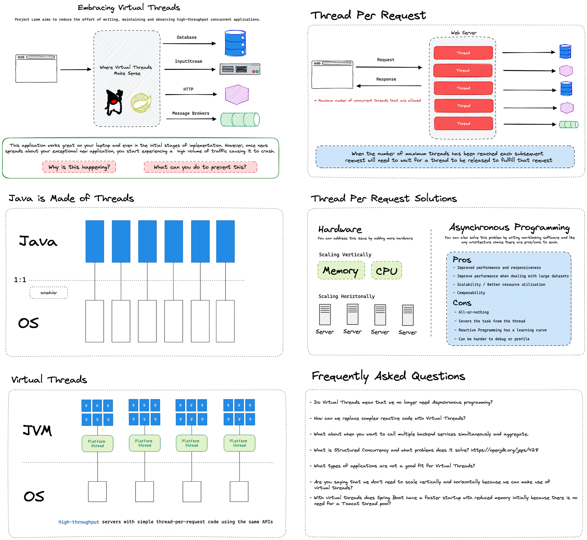

Happy Monday and welcome to another edition of the newsletter. If you're enjoying these conversations, please consider sharing [my newsletter](https://www.danvega.dev/newsletter/) with a friend.

In this edition of "Dan Rambles About What He's Been Up To," I want to talk about Project Loom, GraphQL Mutations, and a very special birthday.

## Project Loom & Virtual Threads

Last week, I spent a lot of time catching up on Project Loom and Virtual Threads. I wanted to give them a test drive in a Spring Boot application for a demo I am putting together. Before discussing the benefits of embracing virtual threads in a Spring application, it's important to provide some context about what they are and why they are needed.

I shared a graphic on [Twitter](https://twitter.com/therealdanvega/status/1638646601295044608) which, as of writing this newsletter, has over 55,000 views. This is amazing and indicates a high level of interest in this topic. Based on feedback, many people have questions about what Project Loom is and what problems it will solve for Spring developers. I hope to answer these and other questions in the near future.

If you have any questions about this, please feel free to reach out and let me know.

## GraphQL Mutations

If you follow me, you know I am a huge fan of GraphQL. If you're interested in getting started with GraphQL, I have a ton of resources on my blog and YouTube channel. However, I don't have much content on mutations in GraphQL, so I decided to change that.

If you aren't aware, there are three main operation types in GraphQL: query, mutation, and subscription. A mutation is used any time you want to change data, such as creating, updating, or deleting a record. In this tutorial, I will show you a few examples of how to create a new resource using a mutation. I will walk you through using simple scalar types, such as strings, a complex object type, and a way to bulk create using a List. I hope you enjoy this tutorial and if you had questions about mutations I hope I answered them.

`youtube:https://youtu.be/u3FFRq3-0CM`

## Happy Birthday Spring

It’s kind of hard to believe but The Spring Framework celebrated it’s 19th birthday last week. If you want you can read the blog post announcing [Spring Framework 1.0](https://spring.io/blog/2004/03/24/spring-framework-1-0-final-released) back on March 24, 2004.

Happy 19th Birthday Spring!

## SpringOne @VMware Explore

This year, SpringOne is teaming up with VMware Explore in Las Vegas from August 21st-24th. The Spring community is essential, and without your voice, there is no Spring. If you are interested in speaking, please [submit a talk](https://event.vmware.com/flow/vmware/explore2023lv/cfp/cfpHome) by April 14th. We would love to hear from you. See you in Vegas!

## Around the web

### 📝 Articles

[Spring 3.0.5](https://spring.io/blog/2023/03/23/spring-boot-3-0-5-available-now) was just released and with it comes Java 20 support.

### 🎬 Videos

I had the pleasure of hosting a new episode of The Golden Path to SpringOne. In [this episode](https://www.youtube.com/watch?v=VgfNCrIVll8), I sat down with Maciej Walkowiak, a great member of our community and an all-around good guy. He spoke about the open-source project he runs, called Spring Cloud AWS, and its newest release, 3.0.

### 🎙 Podcasts

In [this episode](https://www.youtube.com/watch?v=L_Guz73e6fw) of the Lex Friedman Podcast Lex sits down with Sam Altman. If you don’t know Sam is the CEO of OpenAI and they talk about GPT-4, Chat GPT, and the future of AI.

In this episode of the [Inside Java Newscast](https://inside.java/2023/03/23/newscast-44/), [Billy Korando](https://inside.java/u/BillyKorando) walks us through an unboxing of Java 20. That’s right Java 20 was just released and if you want to find out what’s new this is a great video to get caught up on.

### 🐦 Tweet

I was able to unbox the BenQ ScreenBar plus last week and so far I’m very impressed.

[https://twitter.com/therealdanvega/status/1638993071898611731](https://twitter.com/therealdanvega/status/1638993071898611731)

## Until Next Week

I hope you enjoyed this newsletter installment, and I will talk to you in the next one. If you have any links you would like me to include please [contact me](http://twitter.com/therealdanvega) and I might add them to a future newsletter. I hope you have a great week and as always friends...

Happy Coding 
Dan Vega 
danvega@gmail.com 
[https://www.danvega.dev](https://www.danvega.dev)

