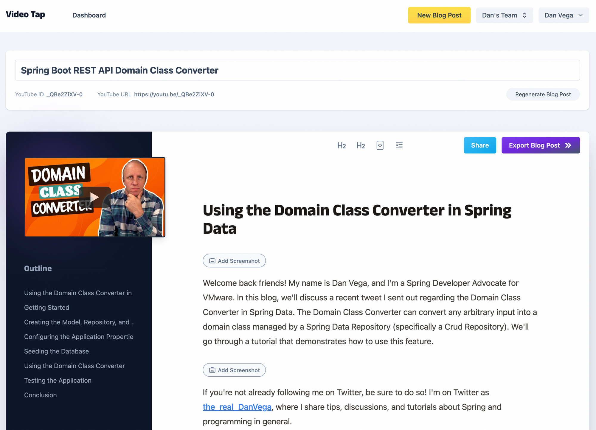

Happy Monday and welcome to another edition of the newsletter. As I send this out, I am heading to the airport to fly down to Atlanta for [Devnexus](https://devnexus.com/). If you're attending the conference, please let me know and be sure to say hi! 👋🏻

This is my first time attending this conference, and everyone has told me how amazing it is. Needless to say, I am beyond excited for this week. My friend Nate and I will be giving a talk on Spring Recipes, and we are scheduled right after the keynote on Wednesday, so you have no excuses.

After the talk, I am really looking forward to catching up with friends, learning new things, and enjoying a good meal or two. Additionally, I will be working at the VMware booth, so feel free to stop by and catch a demo while saying hello.

## Video Tap

I want to start this week by introducing a new service that I'm really excited about. But before I dive into the details of the service, let me explain the problem it solves for me.

As a content creator, I have several mediums through which I can produce content. I write articles for my blog, create content for this newsletter, and produce articles and guides for the Tanzu Developer Center. I also enjoy creating short and long-form videos, as well as entire video courses.

The problem for me is that there is only 1 of me and I have to be very focused on where I spend my time. A big goal of mine is to grow my YouTube channel and so that is where I have been focusing my efforts. I’m not sure many people understand the time that goes into creating a single video but there is a lot that goes into it.

By the time I publish that video I am ready to move on to the next one and don’t have the energy to write a full blog post to go along with the video. I know the argument to that and what some creators do is create the blog post first and use that to drive the video. That sounds great but again I don’t have the time for that and If I did it I think it would take away from [my YouTube channel](http://www.youtube.com/@danvega).

[VideoTap](https://videotapit.com/?via=dan) is a service that transcribes and converts videos into blog posts. They recently increased their video length limit to 25 minutes, which is ideal for most videos. What sets VideoTap apart is the quality of their blog post output. Instead of simply dumping the transcription, they use GPT-4 to generate high-quality blog posts that include code blocks, making them much more compelling articles. Here is a screenshot of a blog post I am currently working on.

If you want to read through a few blog posts that I have recently created using VideoTap you can check out these:

- [GraphQL Mutations](https://www.danvega.dev/blog/2023/03/20/graphql-mutations/)
- [Spring Security Configuration - Lambda DSL](https://www.danvega.dev/blog/2023/03/15/spring-security-lambda-dsl/)
- [Building Command Line Applications with Spring](https://www.danvega.dev/blog/2023/03/02/spring-shell-intro/)
- [Building Native Images with GraalVM](https://www.danvega.dev/blog/2023/02/03/native-images-graalvm/)

The service costs $1 per minute of video and this is reasonably priced. I was thinking about hiring someone to do this and I know this would have cost me 3-4x as much and I’m not sure how they would have turned out. If you’re interested they also have a professional service for $3.00 a minute where they will take all of your videos, convert them and send you back the markdown. They also have a free [YouTube chapters generator](https://videotapit.com/youtube-chapters-generator?ref=dan) which I have found really useful.

[VideoTap](https://videotapit.com/?via=dan) is one of those services that have come along at the perfect time. I can only imagine this service getting better and I’m excited about using it more in my creator workflow.

## SpringOne @VMware Explore

This year, SpringOne is teaming up with VMware Explore in Las Vegas from August 21st-24th. The Spring community is essential, and without your voice, there is no Spring. If you didn’t hear the CFP deadline for VMware Explore has been extend until April 14th. If you’re interested in speaking please submit a talk, we would love to hear from you. See you in Vegas!

## Around the web

### 📝 Articles

I’m a big fan of Nuxt and I enjoyed this article introducing [Nuxt DevTools](https://nuxt.com/blog/introducing-nuxt-devtools). Nuxt really does a great job of putting the developer experience first and this is just another example of that.

### 🎬 Videos

I really enjoyed this panel discussion about [Continuous Learning as a Developer](https://www.youtube.com/watch?v=G1tR2bF1Geg). This is a subject that is near and dear to me as someone who considers himself a life long learner. I thought there panel was great and Layla did a great job running the show.

### 🎙 Podcasts

I’m a big fan of the podcast My First Million. In [this episode](https://www.youtube.com/watch?v=gbDl28Hx9TA) the guys talk with Hubspot Co-founder and CTO Dharmesh Shah about Chat GPT and AI. Dharmesh shares his excitement around AI and says that its the most disruptive technology since the internet became mainstream. I share his enthusiasm for what AI is going to do and how it will amplify us as developers.

### ✍️ Quote of the week

“Comparison is the thief of joy” - Teddy Roosevelt

### 🐦 Tweet

If you weren’t aware you can now use Java 20 in your Spring Boot projects 🤩

[https://twitter.com/therealdanvega/status/1640346550378414080](https://twitter.com/therealdanvega/status/1640346550378414080)

## Until Next Week

I hope you enjoyed this newsletter installment, and I will talk to you in the next one. If you have any links you would like me to include please [contact me](http://twitter.com/therealdanvega) and I might add them to a future newsletter. I hope you have a great week and as always friends...

Happy Coding 
Dan Vega 
danvega@gmail.com 
[https://www.danvega.dev](https://www.danvega.dev)
