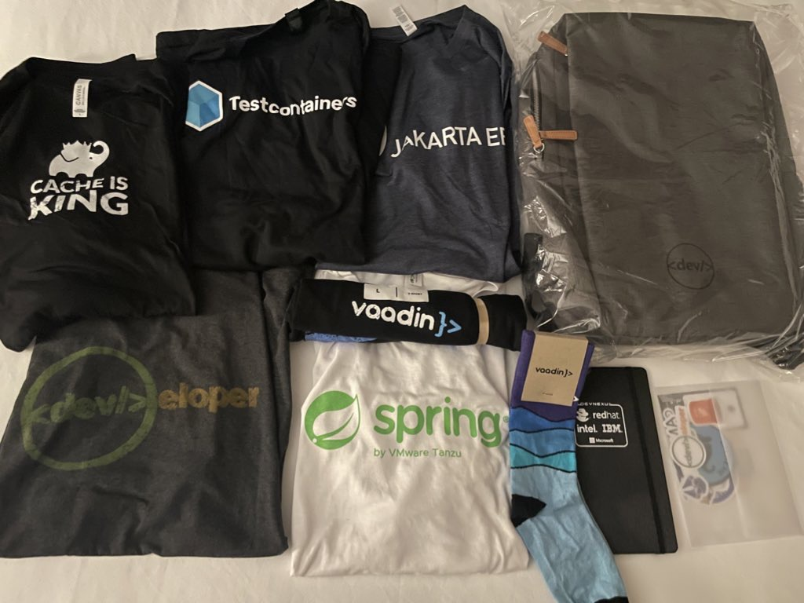

Happy Tuesday and welcome to another edition of the newsletter. In this episode I want to tell you all about my trip to Atlanta for Devnexus 2023. Spring is now in full swing here in Northeast Ohio and I couldn’t be happier. It’s amazing how much getting out for a run or a trip to the park with the family can help your mental well being.

## Devnexus 2023

I attended Devnexus for the first time last week and wow what an incredible week it was. I got in Monday afternoon and started the trip off right with a run with my friend DaShaun. This would be the first of 3 runs on the trip all focused around the beautiful [Centennial Olympic Park](https://www.gwcca.org/centennial-olympic-park) in downtown Atlanta. Monday night I had some dinner with friends and then we went to meet a group at a local pub. This was my first chance to meet so many people including [Sharat Chander](https://twitter.com/Sharat_Chander) who is one of the great people and leaders in our community.

Tuesday afternoon we checked in for the conference at the Georgia World Congress Center and were immediately met by Pratik, and Glenn who are 2 of the amazing organizers who help make this conference happen.

I got a really cool bag as a speaker gift and whole bunch of cool swag by the time the conference was over.

After we were checked in DaShaun and I got setup in one of the presentation rooms and held a [Spring Office Hours](https://youtube.com/live/kkq-FdLzXQk?feature=share) live from Devnexus. We ended up using a tripod, iPhone and a USB microphone and I thought the live stream was pretty good quality. I believe this is the first time we have ever done Office Hours live so that was pretty cool.

Tuesday night was the speaker dinner and it was a great way to kick off the conference. I had the opportunity to meet so many people I have talked to over the years. I really can’t describe just how cool it was to see so many people I have looked up to over the years in the same room. I called it an early night because the 1st day of the conference would be a busy one for me.

### Day 1

I was up early for day 1 like a kid on Christmas morning. DaShaun and I walked over early to the conference early to grab some breakfast. We ate in the speaker room with my good friend Todd Sharp. The 3 of us went into the keynote early so we could get front row seats 🤓

The keynote was given by Arun Gupta from IBM and it would be my favorite presentation of the entire conference. Arun talked about the importance of soft skills and 5 in particular. I’m still not sure if the presentations will be available online to everyone but if they are this is a must watch in my books. Thank you Arun for putting together such a thoughtful and impactful presentation!

[https://twitter.com/arungupta/status/1643663149675970580](https://twitter.com/arungupta/status/1643663149675970580)

I had to dip out of the keynote a few minutes early and get setup for my presentation. My friend Nate Schutta and I presented on Spring Recipes, common sense solutions with Spring. The idea is that there are a vast number of projects in the ecosystem and you might not realize that Spring can do that. We presented a problem and then a way to solve it using Spring. Overall I thought the presentation went well and I’m very appreciative of everyone who came out to watch us.

It was also really great to see and catch up with my friend Ken Kousen who was in the room for our presentation 🤩

## Day 2

Day 1 was a wonderful experience but it was also a really long day. I decided to sleep in a little, got up and went for an amazing morning run! After I got ready and checked out of my room I went over to the conference to catch a little bit of DaShaun’s talk.

After that I was on booth duty and it was my first time working a booth so I didn’t know what to expect. This was a chance for me to tell everyone about this amazing new product we have called [spring.academy](http://spring.academy). I honestly had a blast talking to so many developers and learning about where they work and what they use Spring for.

After booth duties I had to head to the airpot and head back to Cleveland.

[https://twitter.com/therealdanvega/status/1644040591020310528](https://twitter.com/therealdanvega/status/1644040591020310528)

## Conclusion

As with every conference my favorite track was the hallway track. I had the opportunity to talk with so many people and I honestly came away from the conference with a huge sense of pride. I had so many people come up to me and tell me how much my content has helped them over the years. It’s one thing to see a comment on the internet from someone you don’t know, its another level when someone tells you that in person. If my producing content tank was a little empty heading into Devnexus, it’s now filled up! I love this community and I’m thankful for the opportunity to be a part of it. 🙏

## SpringOne @VMware Explore

This year, SpringOne is teaming up with VMware Explore in Las Vegas from August 21st-24th. The Spring community is essential, and without your voice, there is no Spring. If you didn’t hear the CFP deadline for VMware Explore has been extend until April 14th. If you’re interested in speaking please submit a talk, we would love to hear from you. See you in Vegas!

## Until Next Week

I hope you enjoyed this newsletter installment, and I will talk to you in the next one. If you have any links you would like me to include please [contact me](http://twitter.com/therealdanvega) and I might add them to a future newsletter. I hope you have a great week and as always friends...

Happy Coding 
Dan Vega 
danvega@gmail.com 
[https://www.danvega.dev](https://www.danvega.dev)

