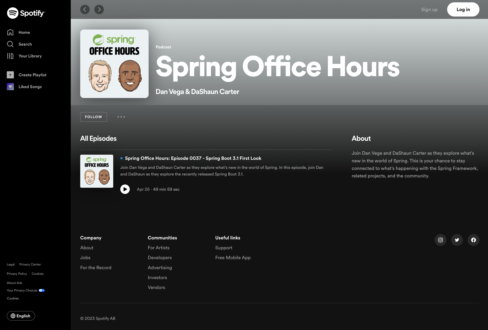
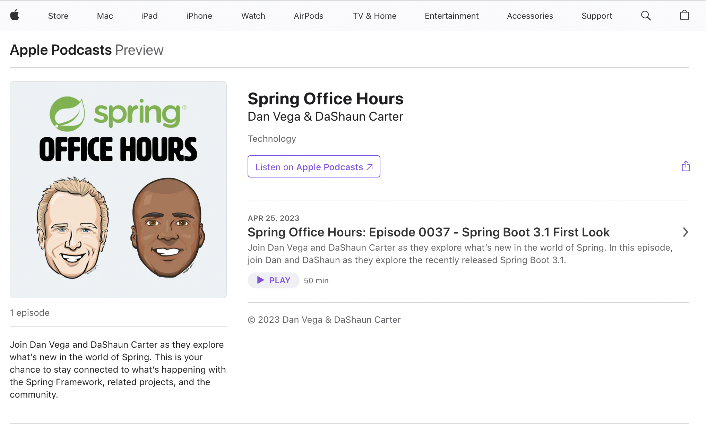

Happy Monday and welcome to another edition of the newsletter. I just want to let you know that there will be no newsletter next week as I will be on vacation in Hilton Head SC with my family. We are really looking forward to some fun in the sun and I am even going to get some golf in. I haven’t golfed in 20 years so I’m just hoping I don’t embarrass myself 🤦‍♂️

In this weeks edition I want to tell you about the Spring Office Hours Podcast and the content I worked on last week.

## Spring Office Hours Podcast

DaShaun and I created the Spring Office Hours live stream a little over a year ago as a way to help answer questions from the community. We began talking about converting this over to a podcast at the end of last year but never got around to doing it.

I think my reservations were the same we all experience when we want to start something new. We want everything to be perfect and if we are honest with ourselves, they never will be. I decided to that this weeks show would be our first “Podcast” and we can always iterate and improve on it each week.

With that we recorded our livestream and tried to keep our audio only friends in mind. From there I signed up for a service called [Transistor.fm](http://Transistor.fm) which helps you manage and distribute podcasts. I extracted the audio from the livestream using Adobe Premiere Pro and uploaded it to Transistor. They handle distributing your podcasts to all of the networks and at the time of this writing we are on all of the major providers.

It would mean the world to me if you would subscribe to our podcast wherever you listen. I absolutely love podcasts and I’m already trying to think of the next one I could do 😜

## Content Creation Machine

Here are the highlights of the content I worked on last week.

## YouTube CLI

I absolutely love being a software developer because it gives me this superpower ability to solve my own problems. Part of my job requires me track the content that I am working on. This is for reporting purposes but also helps me figure out what content is doing well over a longer period of time.

Last year I tracked all of my YouTube videos in a very manual process. Once I month I would go into a spreadsheet and manually enter each video along with some details about it including number of views. This doesn’t scale very well because it’s such a manual process and I’m not updating the number of views so it’s not very accurate either.

I decided to sit down and write a command-line-interface in Java that I could run on my local machine and get these stats. I could have written this using something like bash but to be honest I don’t use it enough and it would have taken me forever to Google (or Chat GPT) everything. I decided to write this using Spring Shell so that I could be in a familiar environment and with Spring Boot 3 I could compile this down to a native executable.

Not only did I have a lot of fun building out this project for myself but I feel like you might get a lot out of it as well. I hope you enjoy this and I would love to hear your thoughts on it.

`youtube:https://youtu.be/Oi8JeTswYVI`

## Spring Boot Docker Compose

Spring Boot 3.1 RC 1 was released a little over a week ago. I had a chance to dig through the release notes and was really excited about a few of the new features. In this video I took a look at one of those features which was the Spring Boot Docker Compose Module.

`youtube:https://youtu.be/lS1GwdIfk0c`

## Spring Security Social Login

Last but not least I have received a few requests for this one. In this tutorial I look at how you can provide a social login for your Spring Boot applications using Spring Security. In the example that I worked on you can login via form login with a username / password or Google & GitHub.

`youtube:https://youtu.be/us0VjFiHogo`

## Around the web

### 📝 Articles

- I can’t even begin to tell you how excited I was to find out that [AWS Lambda now supports Java 17](https://aws.amazon.com/blogs/compute/java-17-runtime-now-available-on-aws-lambda/). In this article my friend Mark Sailes explains what this means for Lambda developers. I can tell you that I have been waiting for this and you can expect some content around this in the near future!
- I really enjoyed this article on [Creating Scalable OpenAI GPT applications in Java](https://foojay.io/today/creating-scalable-openai-gpt-applications-in-java/) by Denis Magda. This article walks you through how to send prompts to GPT and how to scale your application by storing data in YugabyteDB.

### 🎬 Videos

I enjoyed watching [this presentation](https://www.youtube.com/watch?v=--TsEhxgRfg) by Alina Yurenko at Voxxed days Bucharest. Alina is a Developer Advocate for GraalVM and walks us through how to Supercharge your Native Image Applications using GraalVM.

### ✍️ Quote of the week

“The best time to plant a tree was 20 years ago. The second best time is now” - Chinese Proverb

### 🐦 Tweet

[https://twitter.com/therealdanvega/status/1651717016473018370](https://twitter.com/therealdanvega/status/1651717016473018370)

## Until Next Week

I hope you enjoyed this newsletter installment, and I will talk to you in the next one. If you have any links you would like me to include please [contact me](http://twitter.com/therealdanvega) and I might add them to a future newsletter. I hope you have a great week and as always friends...

Happy Coding 
Dan Vega 
danvega@gmail.com 
[https://www.danvega.dev](https://www.danvega.dev)

