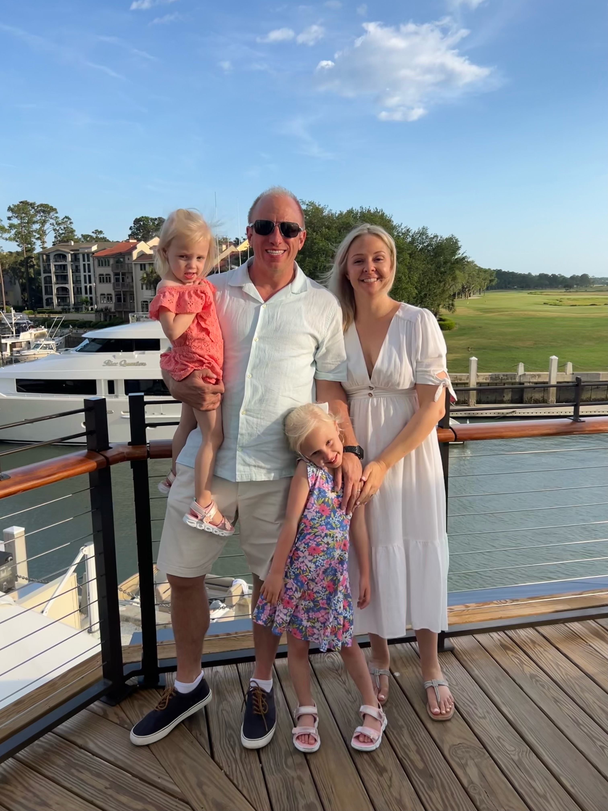
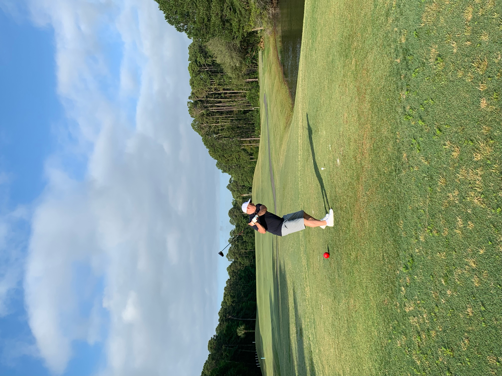

Happy Monday and welcome to another edition of the newsletter. It’s been a couple of weeks since my last update but it was for a good reason. I was able to take a week off and spend some fun in the sun with the family as we headed down to Hilton Head SC which is becoming a yearly tradition for us. I absolutely love Hilton Head, it’s just so calm and relaxing and fun for the whole family.

I played 18 holes at the Old South Golf course, and it was beautiful. This was the first round of golf I played since I was probably 17. Needless to say, I wasn't very good, but I had fun. I am looking forward to playing more golf this summer and improving my game.

Last week, I traveled to Dallas for a customer meeting. Although it was a short trip, it went really well. I had the opportunity to talk to a great group about building GraphQL APIs in Java & Spring. The group was interactive, and there were a ton of really great questions. I have more of these shorter, more focused trips coming up next month, and I'm really excited for them.

## Spring Boot 3.1 released

Spring Boot 3.1 was released and it came packed with some exciting features. If you want to learn more about I would suggest diving into the [release notes](https://github.com/spring-projects/spring-boot/wiki/Spring-Boot-3.1-Release-Notes). The new and noteworthy items were:

- Using Testcontainers at Development Time
- Spring Boot Docker Compose Module
- Unified SSL Configuration
- Auto-configuration for Spring Authorization Server
- Docker Image Building Additions
- Spring for GraphQL Improvements

If you missed it I did a video on the new Spring Boot Docker Compose module

`youtube:https://youtu.be/lS1GwdIfk0c`

## YouTube

While I was on vacation, I reached a nice milestone of 30,000 subscribers on my YouTube channel. The channel is gaining traction, and my plan is to continue producing the same content. I am also looking for sponsors for the channel. If you're interested in partnering with me, please reply to this message with an email.

### AWS Lambda 🤝 Meet Java 17

AWS recently announced support for Java 17 on Lambda. This is exciting because if you are authoring plain Java functions, you can take advantage of all the new language features from Java 11 to 17. If you are a Spring Developer, this means that you can now write your functions in Spring Boot 3 + Spring Cloud Function.

I was thrilled when I heard the news, and I created a tutorial covering these two scenarios.

`youtube:https://youtu.be/bxK4GscuVgs`

## Spring Office Hours Podcast

After a week off we were back to the podcast last week where discussed all things GraphQL. This was the 3rd episode that we released as a podcast and we are continuing to iterate and improve on it. I think the next big step is to get a hook and an outro and those are on my list for this week.

[https://share.transistor.fm/e/1c16ee76](https://share.transistor.fm/e/1c16ee76)

## Devnexus Recordings Available

If you weren’t able to catch [my talk](https://www.youtube.com/watch?v=_jTBKo1qxoA&t=274s) at Devnexus the recordings are now available. I talked about this before but I really enjoyed this conference. I didn’t get a chance to catch a ton of talks though so I was excited to see the recordings made available. I would probably just watch all of them if I were you but if you want a list of a few my favorites here they are:

- [Devnexus 2023 - Keynote: Five Skills to Force Multiply Your Technical Talent - Arun Gupta](https://www.youtube.com/watch?v=0GXmTfNoSlY)
- [Devnexus 2023 - Kontain Your Spring - Craig Walls](https://www.youtube.com/watch?v=EZBHAwuQl_U)
- [Devnexus 2023 - My Children Will Never Deploy Active-Passive - DaShaun Carter](https://www.youtube.com/watch?v=h7RhUVRxqYY)
- [Devnexus 2023 - Bootiful Spring Boot 3 - Josh Long](https://www.youtube.com/watch?v=98cwiZOhoOM)
- [Devnexus 2023 - Live Diagramming of Knative - Core Concepts - Whitney Lee](https://www.notion.so/Spring-Boot-3-1-30K-Subscribers-and-AWS-Lambda-now-supports-Java-17-05fe848e7a124bcd9b625ec8541027a6)

## SpringOne at VMware Explore

Registration is now open for SpringOne at VMware explore. I’’m hoping you join me at one of the best conferences of the year as we talk everything Spring. I am going to be a busy Spring bee there and I can’t wait to tell you more about what I’ll be doing as we get closer.

[https://springone.io/](https://springone.io/)

## Around the web

### 📝 Articles

- This is a really great introduction to [Spring Boot Application Testing and Development with Testcontainers](https://www.atomicjar.com/2023/05/spring-boot-3-1-0-testcontainers-for-testing-and-local-development/). If you didn’t hear Spring Boot 3.1 was released and in that release we adde support for using Testcontainers at development. This article does a great job of diving into this new feature.
- Vue 3.3 has been released and in [this blog post](https://blog.vuejs.org/posts/vue-3-3) you will learn all about it.This release is focused on developer experience improvements - in particular, SFC **<script setup>** usage with TypeScript.

### 🎬 Videos

- I really enjoyed [this video by Colin and Samir](https://www.youtube.com/watch?v=jnNQEiPs5r0) where they interviewed the Deep fake Tom Cruise. I thought it was really great insight into who Miles Fisher is and I honestly can’t remember walking away from an interview pulling for a person more than I have here with Miles. He is funny, creative, super talented and I can’t wait to see what he does next.

### 🐦 Tweet

I’m getting really excited for KCDC next month! If you haven’t registered yet you can do so using the code **FriendOfDanVega** for an extra 10% off. I hope to see you there!

[https://twitter.com/therealdanvega/status/1659182193762082817](https://twitter.com/therealdanvega/status/1659182193762082817)

## Until Next Week

I hope you enjoyed this newsletter installment, and I will talk to you in the next one. If you have any links you would like me to include please [contact me](http://twitter.com/therealdanvega) and I might add them to a future newsletter. I hope you have a great week and as always friends...

Happy Coding 
Dan Vega 
danvega@gmail.com 
[https://www.danvega.dev](https://www.danvega.dev)

