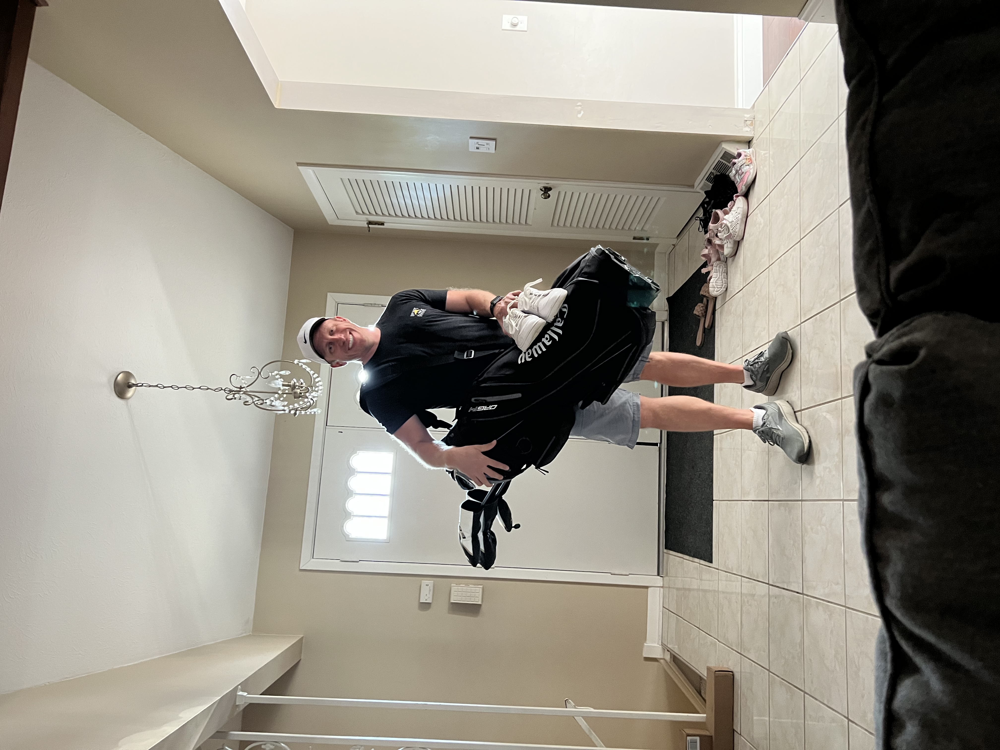
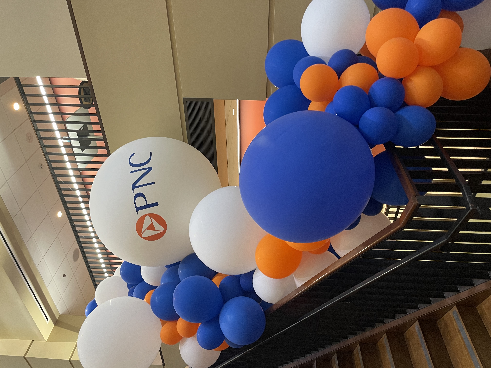
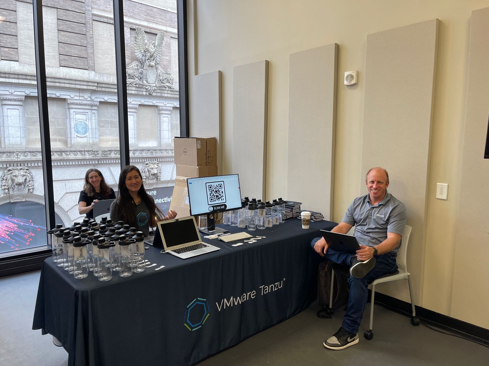
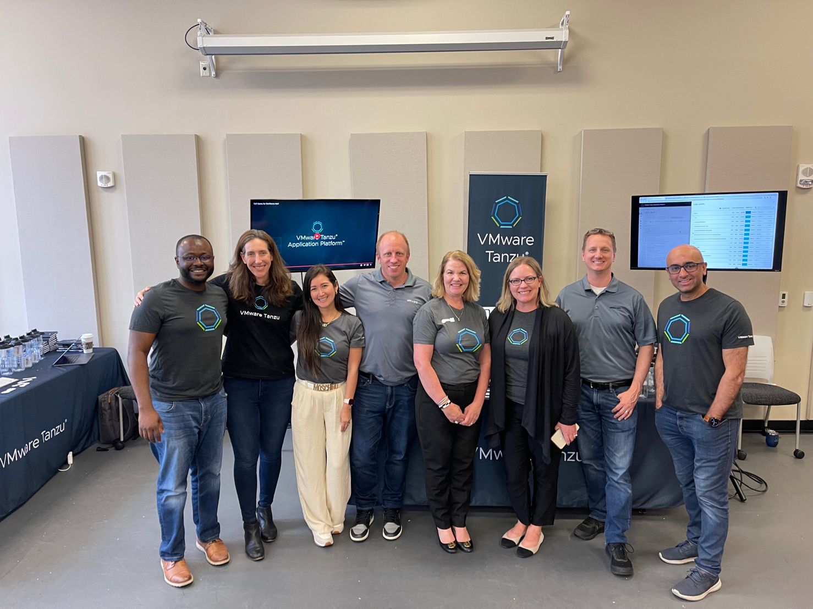

Happy Monday and welcome to another edition of the newsletter. It’s been a few weeks since we last connected and I apologize for that but I have been a busy bee 🐝 June is going to be a pretty busy travel month for me and I hope I get the chance to see some of you on the road this year.

In a previous newsletter I told you that I had taken up golf and my first round ever was played at a beautiful course in Hilton Head SC. Since then I have played 2 more rounds of 18 here in Ohio. I absolutely love the game and love being outside and I’m having fun picking it up. Here is a quick picture my wife took of me heading to the range to try out my new clubs.

## Project Loom / Virtual Threads

Virtual Threads have been finalized for JDK 21, and there is a lot of excitement building for this long-anticipated feature. Last week, I gave a virtual presentation titled "Embracing Virtual Threads in Spring Applications". It was a short, high-level overview, but it was a lot of fun. I’m also spending some time on the subject in a bunch of talks around Spring Boot 3 and Beyond!

I'm really excited about JDK 21 and Spring Framework 6.1 because I think they will bring some really nice improvements to certain types of applications with little to no code changes. If you're interested in learning more, I did a similar video on this back in April.

`youtube:https://youtu.be/Is5HXJhC3jE`

## Tales from the JAR Side

I recently went on a live stream with my friend Ken Kousen. If you're part of the Java ecosystem, you probably already know Ken. However, in case you don't, he's an author, speaker, trainer, Java Champion, and an all-around great guy. During our conversation, we talked about all things Java, Spring, YouTube, and whatever else came up.

If you have the chance, I highly recommend watching the stream. Additionally, please do me a favor and subscribe to Ken's YouTube channel. He's doing an excellent job creating content, and you won't want to miss out on any more of it.

`youtube:https://youtu.be/UhCIW3PQHcI`

## Hello, Pittsburgh!

Last week I traveled to Pittsburgh on what would be a really short trip. I wish I had more time to spend there and I was really hoping to get in a run or catch a Pirates game but sadly I just didn’t have the time, maybe next time.

First up I gave a presentation titled Spring Boot 3 and Beyond to over 250 developers at FedEx Ground headquarters. This was exciting for me because I spent some time working for FedEx (Express) in a consultant role as an Enterprise Architect. I was familiar with the company and how much they have embraced Java and Spring.

### PNC Developer Days

Next up was PNC Bank’s Developer days. I absolutely love it when a company puts this much thought and work into putting together a conference for their developers. There were a ton of great sessions and demos where employees showed off new features and tools that they could use in their day to day workflows.

I had a chance to work our booth that was there where we helping to spread the word of VMware Tanzu and how our suite of products help modern application development workflows. PNC is a big user of Java and Spring so I had the opportunity to talk to everyone from interns to experienced developers and answered a bunch of really great questions. A+ job PNC and I hope to back for another developer day.

## SpringOne at VMware Explore

Registration is now open for SpringOne at VMware explore. I invite you to join me at one of the best conferences of the year, where we'll discuss everything Spring. We have some exciting plans for this year's event, and I'm getting really excited about it. If you're curious about the agenda, it has been posted and you can check it out now. I will be giving a talk on GraphQL and Spring Recipes with my friend Nate Schutta.

[https://springone.io/](https://springone.io/)

## Up Next

Someone asked me recently if I had quit YouTube. It's only been two weeks, so please give me a little more space! 😅 I have a good queue of videos that I want to record, and my plan is to get two of them done this week. I'm also preparing for KCDC next week, where I will be giving a workshop on Getting Started with Spring and a breakout session on Spring Boot 3.

## Around the web

### 📝 Articles

- [Improve performance with Lazy Pattern](https://dev.to/jacobandrewsky/improving-web-performance-with-lazy-pattern-3eia)
- [Spring Authorization Server is now on Spring Initializr](https://spring.io/blog/2023/05/24/spring-authorization-server-is-on-spring-initializr)
- [https://blog.jetbrains.com/idea/2023/06/intellij-idea-2023-2-eap-3/](https://blog.jetbrains.com/idea/2023/06/intellij-idea-2023-2-eap-3/)

### 🎬 Videos

- [Bootiful Spring Boot 3 by Josh Long](https://www.youtube.com/watch?v=J8nbBiAnI6A)
- [Spring I/O 2023 Keynote](https://www.youtube.com/watch?v=IgmeFeTU1a4)

### ✍️ Quote of the week

“Success isn't always about greatness. It's about consistency. Consistent hard work leads to success. Greatness will come.” – **Dwayne Johnson**.

### 🐦 Tweet

I have been working on something that should be coming to a monitor near you very soon!

[https://twitter.com/therealdanvega/status/1667235956850565153](https://twitter.com/therealdanvega/status/1667235956850565153)

## Until Next Week

I hope you enjoyed this newsletter installment, and I will talk to you in the next one. If you have any links you would like me to include please [contact me](http://twitter.com/therealdanvega) and I might add them to a future newsletter. I hope you have a great week and as always friends...

Happy Coding 
Dan Vega 
danvega@gmail.com 
[https://www.danvega.dev](https://www.danvega.dev)
