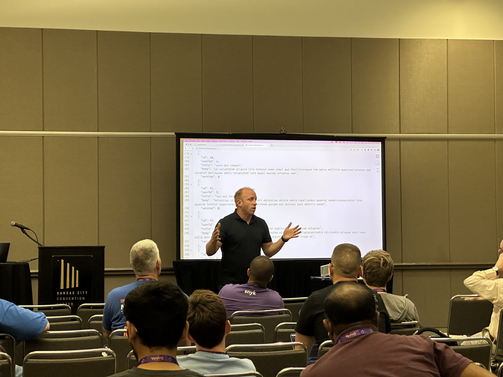

Happy Monday and welcome to another edition of the newsletter. I spent last week in Kansas City for the Kansas City Developers Conference (KCDC) and wow was it a great week. First off I want to thank all of the conference organizers for putting on another amazing conference. They do an amazing job of putting together a really great schedule of presentations and I was honored to have 2 talks there. The swag from the conference was really good my only wish was that the sponsors had more t-shirts because selfishly I would like them for streams / videos.

First up on Wednesday was a 4 hour Intro to Spring Workshop and this was the 2nd time DaShaun and i gave this one. We learned a lot from the first iteration and I think we made some really nice improvements. I think there were some things we can definitely improve on for the next one but overall I was really happy with how this one turned out. We had a really engaged audience and they asked some really great questions. One attendee (Kevin, up front) even said he just started watching my [4 hour intro to Spring Crash Course](https://youtu.be/UgX5lgv4uVM) on YouTube and was excited to find out I was teaching this workshop.

Wednesday night was the speaker dinner and it was great to see so many friendly and familiar faces. The venue was really cool spanning 3 levels and on the top level was some delicious BBQ.

On Thursday I gave my Spring Boot 3 and Beyond talk. In this presentation I covered Spring Boot 3.0, 3.1 and a bonus discussion on Virtual Threads support in Spring Boot 3.2. The room was packed and again a very engaged audience. I was brave and decided on live coding for about 20 minutes to show off some cool features and the demo gods were smiling down on me as everything just worked. Speaking of live coding at conferences what is with the podiums that they give us that have us slouching over with arms at a weird angle to write code with 🤦‍♂️ I found a drink table outside of the room and ended up bringing it in so that I had something usable to code on.

Finally I want to point out that the Kansas City Airport (MCI) was brand new and It is really nice. It is so great that when I got off the plane I had a moment where I questioned if I was in the right city or not. Thanks for having me KCDC and I hope to back next year!

## Tales from the JAR Side

My friend Ken Kousen created a video about the videos I created on HTTP Interfaces. I thought this was an awesome video and Ken had fun with it and added some value on top of what I did. If you haven’t subscribed to Ken’s YouTube channel yet, what are you waiting for?

`youtube:https://youtu.be/6ayPzBknMpA`

## SpringOne at VMware Explore

Registration is now open for SpringOne at VMware explore. I invite you to join me at one of the best conferences of the year, where we'll discuss everything Spring. We have some exciting plans for this year's event, and I'm getting really excited about it. If you're curious about the agenda, it has been posted and you can check it out now. I will be giving a talk on GraphQL and Spring Recipes with my friend Nate Schutta.

[https://springone.io/](https://springone.io/)

## Around the web

### 🎬 Videos

The videos for my series on the NetNinja channel on building a portfolio site with Nuxt / Tailwind CSS / GraphQL have all been released. I really had a lot of fun putting this together and I hope you enjoy it

- [Portfolio Build with Nuxt Content & GraphQL - Part 1](https://www.youtube.com/watch?v=b6b2yZZNG6Y&t=1s)
- [Portfolio Build with Nuxt Content & GraphQL - Part 2](https://www.youtube.com/watch?v=eXSVyfBLtnY&t=1s)
- [Portfolio Build with Nuxt Content & GraphQL - Part 3](https://www.youtube.com/watch?v=oh2KQqtJLhA&t=136s)
- [Portfolio Build with Nuxt Content & GraphQL - Part 4](https://www.youtube.com/watch?v=GXgWQN_NJnA&t=259s)
- [Portfolio Build with Nuxt Content & GraphQL - Part 5](https://www.youtube.com/watch?v=Vh357OVNSlo&t=373s)
- [Portfolio Build with Nuxt Content & GraphQL - Part 6](https://www.youtube.com/watch?v=R0hAI0qUvmk&t=9s)

### 🐦 Tweet

I can’t believe Google Domains is being sold off to Squarespace 🤦‍♂️

[https://twitter.com/therealdanvega/status/1669493112794759169](https://twitter.com/therealdanvega/status/1669493112794759169)

## Until Next Week

I hope you enjoyed this newsletter installment, and I will talk to you in the next one. If you have any links you would like me to include please [contact me](http://twitter.com/therealdanvega) and I might add them to a future newsletter. I hope you have a great week and as always friends...

Happy Coding 
Dan Vega 
danvega@gmail.com 
[https://www.danvega.dev](https://www.danvega.dev)
