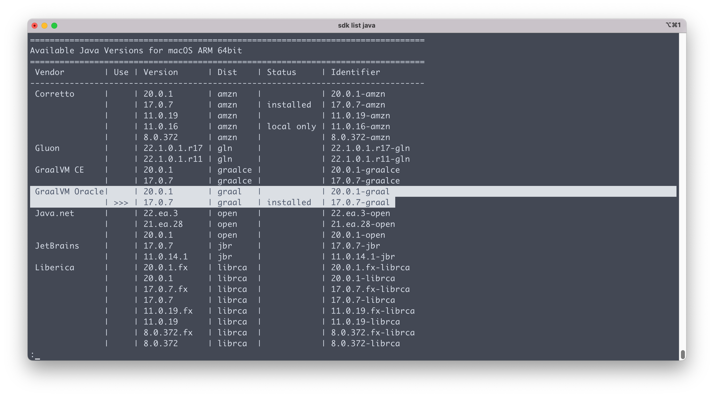

Happy Monday and welcome to another edition of the newsletter. Tomorrow is the 4th of July, also known as Independence Day, which is a federal holiday in the United States commemorating the Declaration of Independence. This happens to be a family favorite holiday in our household that kicks with a kids bike parade behind a fire truck in our neighborhood. If you’re celebrating I hope you have an amazing holiday spent with family and friends. In this edition of the newsletter I want to talk to you about deploying Spring Boot 3 applications on AWS Lambda, A quick trip to Detroit and Oracle GraalVM.

## Spring Boot 3 on AWS Lambda

When it comes to deploying frontend applications, there are many great options available, whether you're working on a personal project or just trying to get something up and running. While Java is the 800 lb gorilla in the room and solves problems for some of the biggest enterprises in the world, it may not be the best choice for personal or weekend hacking projects. Recently, I've been exploring AWS Lambda as a solution to this problem, and it turns out to be a really great one.

When you manage your own server, you have to think about things like patching, security, and scaling. When you deploy an application to a server, you have to consider how much traffic your application will receive. If your server is running at 100% utilization, you might need to scale up to handle the load. If it's running at 10% utilization, you might want to scale down to save money.

AWS Lambda is a serverless compute service that lets you run code without provisioning or managing servers. You pay only for the compute time you consume. This means that my personal project, which won't receive a ton of traffic, is an ideal candidate for AWS Lambda. Any applications with variable traffic or that can scale to zero are great candidates for this use case.

I have looked at the concept for deploying functions as a service (FaaS) but in this tutorial we are going to deploy an entire Spring Boot REST API. If you look at the [AWS Pricing Page](https://aws.amazon.com/lambda/pricing/) you will see that The AWS Lambda free tier includes one million free requests per month and 400,000 GB-seconds of compute time per month. This means that for most of the side projects I am working on I can deploy them to AWS Lambda and not have to pay anything.

`youtube:https://youtu.be/GGPPkUcHleQ`

## Spring Cloud Gateway

Last week I had a quick trip to Detroit for a SpringOne Tour stop. This was my first time staying in Downtown Detroit and I have to say that I really enjoyed my stay. I love running in new cities and usually part of my judgement on your city is how friendly of a walking/running area you have. I took in some great sights like all 3 stadiums downtown and the river walk where I was able to wave hi 👋🏻 to our friends in Canada.

After day 1 of presentations DaShaun and and sat down to record a new episode of the Spring Office Hours Podcast. We were lucky enough to have [Spencer Gibb](https://twitter.com/spencerbgibb) in Detroit so we decided to sit down and talk to him about all things Spring Cloud  + Spring Cloud Gateway. I thought this was a really great level setting conversation on Spring Cloud and some of the use cases for an API Gateway. I want to create some tutorials around Spring Cloud Gateway but would love to hear from you. Is that something you would like to see? What problems are you facing?

`youtube:https://youtu.be/eq1aO9IpEIM`

## Oracle GraalVM

If you haven't heard, GraalVM is now Oracle GraalVM, and there are a few exciting things that come with [this announcement](https://medium.com/graalvm/a-new-graalvm-release-and-new-free-license-4aab483692f5). The first thing to note is that Oracle GraalVM now supports JDK 17 and 20, and the best part is that it's free. Another update is that if you're using it to generate native images, you no longer need to install a separate tool for that, as it now comes with it. If you want to download it you can do from the [Oracle GraalVM site](https://www.graalvm.org/downloads/) or by using [SDK Man](https://sdkman.io/).

## Around the web

### 📝 Articles

- There were a lot of exciting announcements from YouTube last week during VidCon. The first was a [new tool](https://techcrunch.com/2023/06/23/youtube-integrates-ai-powered-dubbing-tool/) that could dub your videos into other languages using AI. The next tool was something that creators have been asking for for as long as I can remember. YouTube is now beta testing a tool to [A/B test your thumbnails](https://www.theverge.com/2023/6/23/23771045/youtube-test-and-compare-a-b-testing-thumbnails-feature).

### 🎬 Videos

- While we are talking about Spring Cloud Gateway I really enjoyed this video from Spring I/O 2023 by Iván López on [Dynamic OpenAPIs with Spring Cloud Gateway](https://www.youtube.com/watch?v=NjqgXzCSu7M). I thought he did a really good job of introducing us to API gateways and some of the use cases.

### ✍️ Quote of the week

“We are what we repeatedly do. Excellence, then, is not an act, but a habit.”

### 🐦 Tweet

Marcus Hellberg had an interesting tweet about some of the interesting trends in the Java Ecosystem. No surprise to see some of my favorite topics on there like Spring Boot, Serverless and GraalVM.

[https://twitter.com/marcushellberg/status/1674458944255959041](https://twitter.com/marcushellberg/status/1674458944255959041)

## Until Next Week

I hope you enjoyed this newsletter installment, and I will talk to you in the next one. If you have any links you would like me to include please [contact me](http://twitter.com/therealdanvega) and I might add them to a future newsletter. I hope you have a great week and as always friends...

Happy Coding 
Dan Vega 
danvega@gmail.com 
[https://www.danvega.dev](https://www.danvega.dev)
