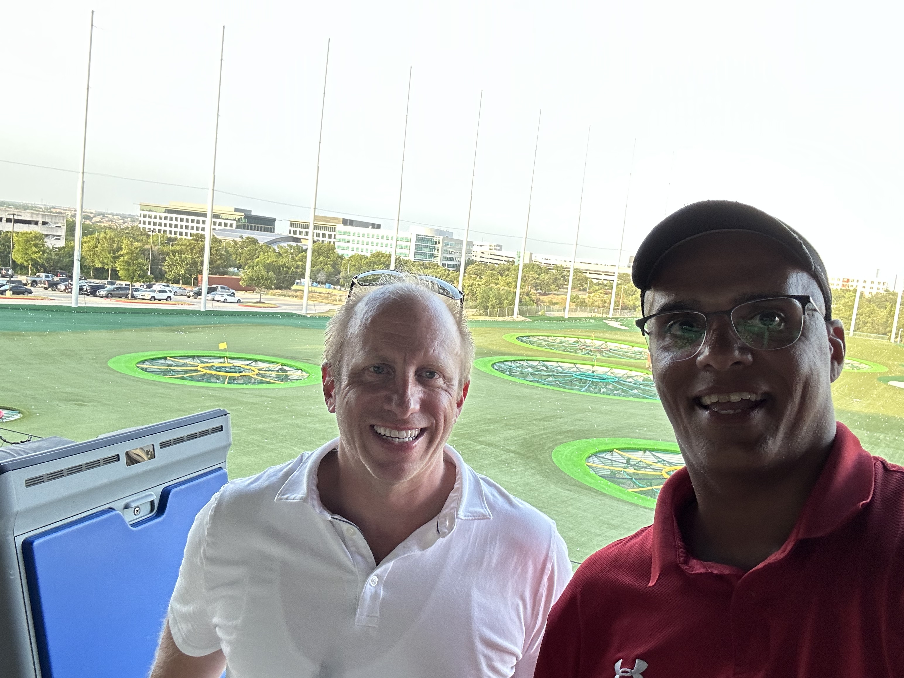
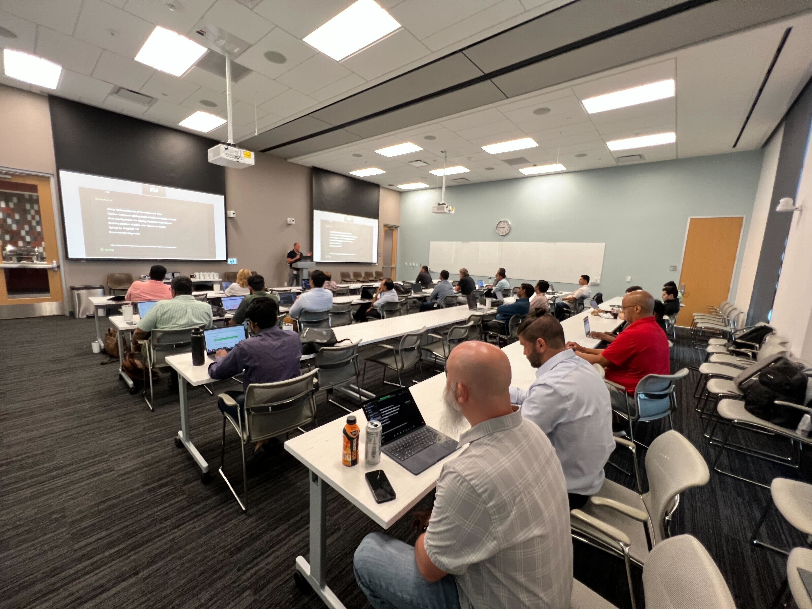

Happy Monday and welcome to another edition of the newsletter! In this issue, I'll share my quick trip to Austin, new features in Spring for GraphQL, and updates about SpringOne at VMware Explore.

Last week, I visited Austin, TX for a SpringOne Tour stop at a customer's location. As I started packing for the trip, I realized it was going to be 100 degrees all week. Though I packed some clothes to run with, it was still too hot even at 6 AM 🥵.

We had a great team dinner at Vince Young's Steakhouse downtown, which was about a 20-minute drive from where I was staying in the Domain. The Domain is a really cool area with all kinds of shops, and I saw a lot of big tech companies in the area. I would love to go back there one day and spend some time with my family. I was also really close to Top Golf and spent some time hanging out with my coworkers.

## Spring for GraphQL

Last week, I spent some time exploring the new features in Spring for GraphQL. I began by examining the new schema mapping inspection report, which can help you identify mapping issues between your schema and data fetchers. I recorded and published a video on this topic, which you can watch below.

`youtube:https://youtu.be/YBPG0JbHvpY`

During the week, I invested a lot of time in exploring the new paging and sorting features added in Spring for GraphQL 1.2. Thanks to this feature, we now have a standard way of doing paging in GraphQL using the Cursor connection specification. I concluded the week by examining the observation support, which provides us with metrics and insights into the performance of our API. I recorded several videos about GraphQL and will be releasing at least two of them this week, so stay tuned. By the way, if you haven't subscribed to my [YouTube channel](https://www.youtube.com/@danvega), what are you waiting for?

## SpringOne at VMWare Explore

SpringOne at VMware Explore is coming up and I couldn't be more excited for this conference! The [schedule](https://springone.io/schedule) was just released, and I can finally discuss everything that I am working on for it.

I have three talks scheduled, and I will also be working the booth throughout the week. Make sure to stop by and say hi! On day one, I will be giving a talk on Spring for GraphQL, and later that day, I'll be giving another talk with my good friend Nate Schutta on Spring Recipes. On day four, I will also be joining Nate to discuss Spring for Architects.

We are also planning a 5k run, so if you're interested in running with us, stay tuned for more information. Additionally, we are working on a live session of Spring Office Hours. It's going to be an exciting conference, and I can't wait to see all of you there. If you haven't registered yet, please do so now and join me and all of my friends for what is sure to be the conference of the year!

[https://springone.io/](https://springone.io/)

## Around the web

### 📝 Articles

- I don’t think there is much more to say than Bravo Oracle 👏🏻 Check out [this article](https://www.oracle.com/news/announcement/blog/keep-linux-open-and-free-2023-07-10/) about keeping Linux open and free.

### 🎬 Videos

- I enjoyed watching [this video](https://www.youtube.com/watch?v=ccj2-FsfnzE) by Mark Pollack, which showcases the features of the new Spring CLI. This experimental project is designed to help you create new Spring-based projects and add functionality after the application is already up and running.

### ✍️ Quote of the week

“The only person you are destined to become is the person you decide to be.” - Ralph Waldo Emerson

### 🐦 Tweet

I wrote a quick appreciation post about where I am in my career while I was finishing this newsletter last night and I thought I would share it with you.

[https://twitter.com/therealdanvega/status/1680762913651322880](https://twitter.com/therealdanvega/status/1680762913651322880)

## Until Next Week

I hope you enjoyed this newsletter installment, and I will talk to you in the next one. If you have any links you would like me to include please [contact me](http://twitter.com/therealdanvega) and I might add them to a future newsletter. I hope you have a great week and as always friends...

Happy Coding 
Dan Vega 
danvega@gmail.com 
[http://www.danvega.dev](http://www.danvega.dev)
