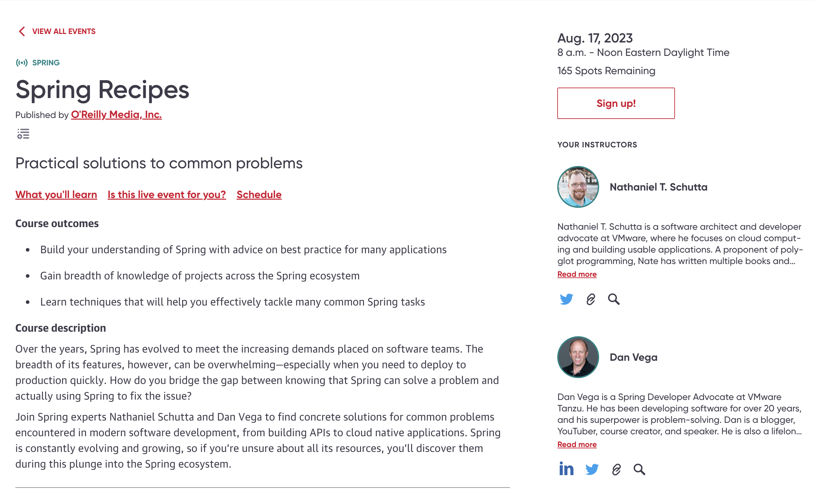

Happy Monday and welcome to another edition of the newsletter. This week I want to talk to you about the current state of content creation for me, a couple of videos I worked on last week and a big announcement about SpringOne at VMware Explore!

Last week I received the photos that were taken at KCDC and wow were these some great action shots. Thanks to the talented [Tiffany Buckley](https://tiffanybuckley.com/aboutme) for the pictures and capturing my session on Spring Boot 3 and Beyond!

## The Content Creation Machine

I want to take some time this week to discuss the current state of my content creation machine. I'm very fortunate to be where I am in my career and to love what I do every day. However, I also want to be open about the other side of content creation.

People often say that postal workers or couriers have stressful lives because their job never truly ends. Even if they work hard every week, the work just keeps piling up. While they may be rewarded for their hard work, that feeling of never being "done" must take a toll.

I have certainly felt this weight of never being done before, and it has been weighing on me even more lately. I'm a big believer in task lists and organizing both my personal and work life in lists. I use Notion for work to plan out my year, quarter, week, and days. I also use it to plan out what content I want to work on and use it to move from idea to production.

When it comes to content creation, there are several things I could be working on at any time:

- Code Demos (GitHub Repo)
    - A topic I'm learning about
    - A README to explain what this repo is for
- Newsletter
- Video
- Blog Post
- Presentation
    - Customer / Conference / Training
- My Website

With so many mediums to work on, I need to establish a process for reusing the content I'm working on. Without such a process, I become scatterbrained and can't stop thinking about which of these mediums I'm neglecting and how to resolve that.

### Content Reuse

I realize that one of the reasons I get so stressed out is because I have too many projects and mediums to focus on. If I can simplify and focus on a single piece of content, it might take away some of my stress. Let's take the example of a project I plan to work on soon: creating content around the new and exciting Spring CLI project that [Mark Pollack](https://tanzu.vmware.com/developer/team/mark-pollack/) is working on.

To start, I need to create a demo and understand the topic well enough to explain it to others. Once I have the code ready, I can create a GitHub repository to serve as a reference for this topic.

The repository's README is a great place to describe the tutorial and explain its purpose to anyone who comes across it. The README should include:

- About
    - Title
    - Description
        - Used for Blog Post Meta Data (Description)
        - Used for YouTube Description
- Links to (future)
    - Blog post
    - Video
    - Newsletter

**YouTube Tutorial**

Now that I have code and copy for the tutorial, I can proceed to create a video tutorial. Although I do not script my videos, I like to write out an agenda. Here are the items I plan to cover in the intro, tutorial, and outro. I want to be clear about what viewers will gain from this tutorial so they have a clear understanding of the outcome.

I hit the record button and begin capturing my screen and A-roll footage to teach you about the topic at hand. In an effort to grab your attention in the thumbnail, I also record myself in silly poses. Once the footage is captured, it's time to move to the editing floor and create the best video I can with the time I have. In a perfect world, I would have the money to hire someone with more time and skill to work on these videos. Lately, I've had the feeling that my videos have been stale and even [put out a tweet about it this week](https://twitter.com/therealdanvega/status/1681850663125303297).

After recording the video, I create a thumbnail and publish it on YouTube. Reusing the title and description we thought about earlier comes in handy, as I do not have to rewrite the same content.

**Blog Post**

When I first started blogging, it was easy to write for the blog since it was the only medium I had to focus on. However, with so many places to post content these days, it has become almost impossible for me to focus on writing new articles. Nevertheless, I have finally come to terms with this. I can express myself in written form through the newsletter, so writing articles is no longer an itch I need to scratch.

That being said, I still want to post articles. When I'm working on a new tutorial, like the Spring CLI one I'm currently working on, I still want to provide it in written form. Specifically, I want an article that gets picked up by search engines when people search for answers to their questions. When someone lands on this search result, I want to provide the video I have already worked on and include some form of the video in written form.

I previously tried posting the transcript from the video on the blog, but it did not work out well. Therefore, I now use an amazing service called [VideoTap](https://www.danvega.dev/blog/2023/03/31/videotap/) that helps me turn a video into a blog post, and it works really well.

**Newsletter**

Every week, I put together a newsletter that allows me to write without worrying about analytics. I don't care if it shows up in search rankings or how many views it gets. I write because I enjoy it.

At least, that's what I told myself when I started. These days, however, I have to wonder if I'm spending my time wisely. While I add notes to my newsletter throughout the week, I also end up spending a few hours on my only free weekend day, Sunday, to finish it, as I'm doing right now.

Now that I've put pressure on myself to deliver this newsletter each week, I want to see a reward for my hard work. Although my open rate is okay and there are ways to increase subscribers, I have to question if it's worth my time and effort to focus on these things.

The other part of this process is something that has been bothering me for awhile. Currently I write this newsletter in Notion and then export it to markdown. I pull that into my website and then fix up images, YouTube videos and more to fit within the framework of my site. After that has been pushed to production I need to export the markdown from Notion to ConvertKit which is the tool I use to send out this newsletter. I really need to find a way streamline this process and I think that will make it feel less like a chore.

**Presentations**

The combination of all the content above are the building blocks for my presentations. These are talks that I turn into for customers, conferences and workshops.

### Conclusion

I'm not sure if anyone will find this useful, but I wanted to get it all out. I love what I do every single day, but that doesn't mean it's stress-free. Without a plan, things will continue to be overwhelming. So, I'm trying to make some adjustments. I'll treat each new topic as a project, and each project will have a number of content pieces to create. Once I finish a project, I can move on to a new one instead of being stuck in a never-ending cycle of stressful content creation.

I also realize that I am a problem solver, and I need to spend some time solving the problems in my workflow. Doing so will save me time and reduce stress.

## New Content

Speaking of content here are a couple of videos I worked on last week:

### pgAdmin Spring Boot Docker Compose Module

Are you tired of dealing with complex development environments? Look no further than this beginner-friendly tutorial on streamlining your development process with Spring Boot, PostgreSQL, and pgAdmin in Docker. I'll walk you through the steps to set up your environment using Docker Compose, so you can focus on writing code instead of worrying about infrastructure. Join me and discover how to build and deploy faster with this efficient and easy-to-use setup.

`youtube:https://youtu.be/XDlgWyVfSMA`

### GraphQL Pagination Support in Spring for GraphQL

In this tutorial you are going to learn how to perform pagination in Spring for GraphQL using the cursor connection specification. You will start by building out a GraphQL API and then we will look at when you might want to introduce paging.

`youtube:https://youtu.be/3YTSh8vJ8eY`

## Spring Recipes on the O’Reilly Learning Platform

I’m excited to announce that on August 17th my friend and coworker Nate Schutta and I will be presenting [Spring Recipes on the O’Reilly Learning Platform](https://learning.oreilly.com/live-events/spring-recipes/0636920095810/). If you’re on the platform I hope you can sign up and join us for a morning full of learning Spring!

## SpringOne at VMWare Explore

SpringOne at VMware Explore is coming up and I couldn't be more excited for this conference! The [schedule](https://springone.io/schedule) was just released, and I can finally discuss everything that I am working on for it.

I have three talks scheduled, and I will also be working the booth throughout the week. Make sure to stop by and say hi! On day one, I will be giving a talk on Spring for GraphQL, and later that day, I'll be giving another talk with my good friend Nate Schutta on Spring Recipes. On day four, I will also be joining Nate to discuss Spring for Architects.

We are also planning a 5k run, so if you're interested in running with us, stay tuned for more information. Additionally, we are working on a live session of Spring Office Hours. It's going to be an exciting conference, and I can't wait to see all of you there. If you haven't registered yet, please do so now and join me and all of my friends for what is sure to be the conference of the year!

[https://springone.io/](https://springone.io/)

## Around the web

### 📝 Articles

I really enjoyed this article by Brian Vermeer on How to do password hashing in Java applications the right way. There was a nice example of using the `spring-security-crypto` dependency and using the `Argon2PasswordEncoder`.

### 👨🏼‍💻 Projects

[Hibernate 6.3 CR1](https://in.relation.to/2023/07/20/orm-63cr1/) now supports query methods.

### ✍️ Quote of the week

Peace is the result of retraining your mind to process life as it is rather than as you think it should be. – Dr. Wayne W. Dyer

## Until Next Week

I hope you enjoyed this newsletter installment, and I will talk to you in the next one. If you have any links you would like me to include please [contact me](http://twitter.com/therealdanvega) and I might add them to a future newsletter. I hope you have a great week and as always friends...

Happy Coding 
Dan Vega 
danvega@gmail.com 
[https://www.danvega.dev](https://www.danvega.dev) 
