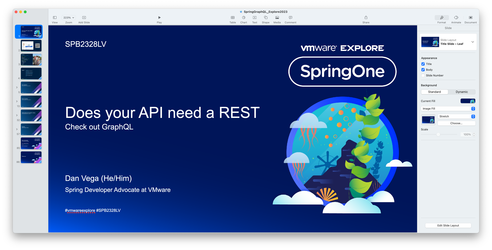
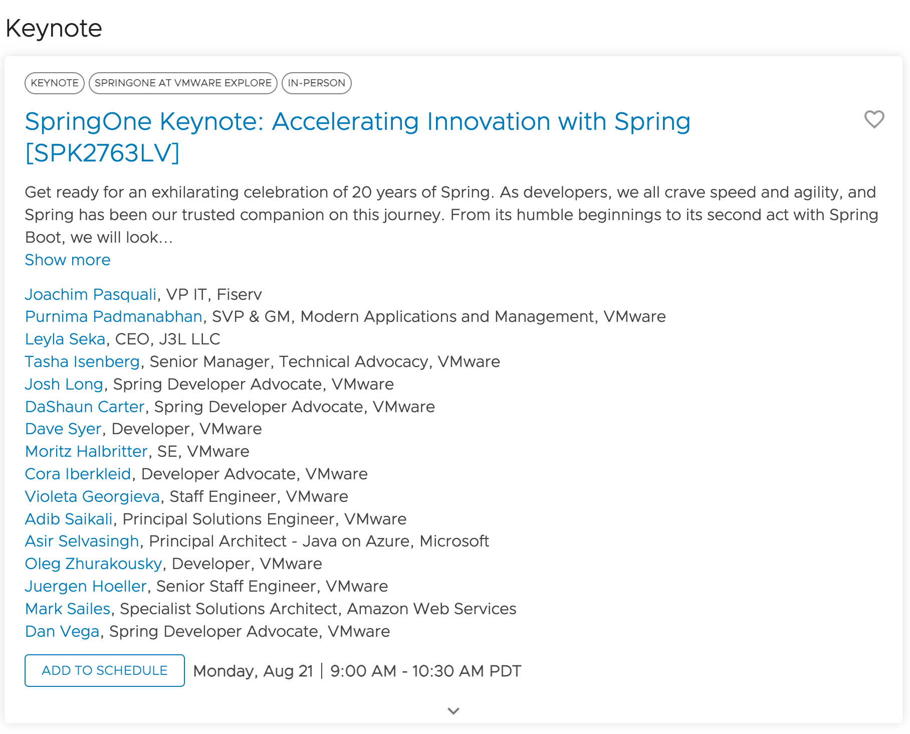

Happy Monday and welcome to another edition of the newsletter! This will be my last week in the office before my family and I head off to San Destin, FL for a little vacation. I absolutely love the white water and amazing beaches there. I’m really looking forward to some rest and relaxation, as well as some golf!

This week, I want to catch up on what’s new in Spring, based on a conversation I had with DaShaun during [Spring Office Hours](https://springofficehours.io/). Additionally, I spent all of last week rewriting my slide deck for my GraphQL talk at SpringOne this year, so I’ll touch on some things that are top of mind with that. Finally, be sure to stick around until the end for a huge announcement.

## What’s new in Spring

DaShaun and I were finally both home to record a new episode of Spring Office Hours. We noted at the beginning of the episode that we have both been traveling a lot for work lately. With some time between episodes, we thought it would be a good opportunity to catch up on all the news in the Spring Ecosystem. There were some big releases in [Spring Framework 6.1 M1](https://spring.io/blog/2023/06/15/spring-framework-6-1-m1-released) and [Spring Boot 3.2 M1](https://github.com/spring-projects/spring-boot/wiki/Spring-Boot-3.2.0-M1-Release-Notes). There has also been a lot of talk about the new [RestClient](https://spring.io/blog/2023/07/13/new-in-spring-6-1-restclient) and Spring Cloud Gateway's support for MVC coming later this year.

It's an exciting time to be a Spring Developer! We have three more shows before we are in Vegas for SpringOne, and we plan on doing an episode live there. This is just a reminder that you can now find the podcast on all your favorite podcast networks. If you're enjoying the show, please do us a favor and leave a review.

`youtube:https://youtu.be/eUKqjRV1zEE`

## SpringOne at VMware Explore

Last week, I spent most of my time working on my slide deck for my GraphQL talk. Although I have given a similar talk about 20 times before, I felt that I had learned a lot over the past year. Therefore, I decided to start from scratch and incorporate what I had learned. I am pleased with the result and feel that the presentation flows well. Despite only having 40 minutes, I was able to pack a substantial amount of content into it.

### Huge Announcement

I can’t believe this is actually happening but yours truly will be on the main stage during this years keynote! I have a small part but couldn’t be more excited to join so many of my amazing colleagues on stage for what should be an amazing presentation. If you are going to SpringOne make sure you take advantage of the [scheduler](https://event.vmware.com/flow/vmware/explore2023lv/content/page/catalog?search.sessiontype=1684866685619001w4UD&src=WWW_us_MRC_dqgsrvt1ho7td&cid=7012H000000wtgaQAA) and sign up for the talks you want to attend.

## Upcoming Content

I have a list of videos I want to work on but we all have priorities and right now that’s SpringOne. If I have anytime I will try and get something out but it might be slow until the conference ends.

- I’ll be joining [Marco Behler](https://twitter.com/MarcoBehler/status/1684858548235198464) on his YouTube channel this week for a live stream. We are going have a good conversation and build something in Spring and I am really looking forward to this.
- I’m excited to announce that on August 17th my friend and coworker Nate Schutta and I will be presenting [Spring Recipes on the O’Reilly Learning Platform](https://learning.oreilly.com/live-events/spring-recipes/0636920095810/). If you’re on the platform I hope you can sign up and join us for a morning full of learning Spring!

## Around the web

### 📝 Articles

- I really enjoyed this article by my colleague Nick Kuhn on extended Spring Runtime Support. If you’re running Spring Boot 2.7.x in production open source support will end this November. With VMware Spring Runtime support you can get peace of mind through our extended support.

### 🐦 Tweet

This is a public service announcement to stop repeating patterns that make no sense.

[https://twitter.com/therealdanvega/status/1684951821444435969](https://twitter.com/therealdanvega/status/1684951821444435969)

## Until Next Week

I hope you enjoyed this newsletter installment, and I will talk to you in the next one. If you have any links you would like me to include please [contact me](http://twitter.com/therealdanvega) and I might add them to a future newsletter. I hope you have a great week and as always friends...

Happy Coding 
Dan Vega 
danvega@gmail.com 
[https://www.danvega.dev](https://www.danvega.dev)
