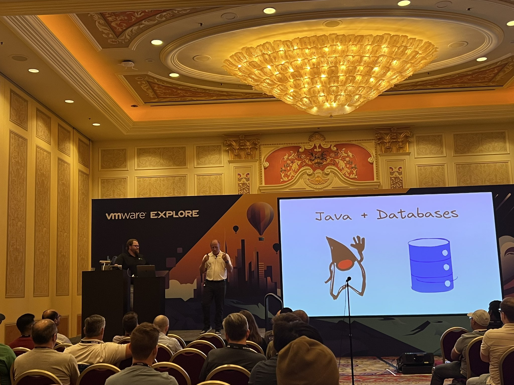

Welcome to another edition of the newsletter! This is a special edition in which I will be recapping SpringOne and VMware Explore. If you've been following this newsletter, Twitter, or Spring Office Hours, you'll know that I had a busy few months leading up to SpringOne. As I write this on Sunday night, I can say that while it was one of the most amazing conferences I've ever had the opportunity to be a part of, it was also exhausting.

This is the first year that we've combined SpringOne and VMware Explore, and the first time we've been in person since 2019. VMware Explore was in person last year at the Moscone Center, and this year it moved to the Venetian Expo Center in Las Vegas. I'm a big fan of Vegas, and I thought it was a perfect setting for the conference, and the Venetian was an excellent host.

I arrived late on Saturday night because I was originally going to be part of the keynote speech, and we had a dress rehearsal scheduled for Sunday morning. However, my flight was delayed, and I didn't arrive in Vegas until 1 AM local time. By the time I got to bed, it was already a little after 2 AM. I don't sleep well on planes, so I only managed to get around 5 hours of sleep.

Despite knowing that my part had been cut from the keynote, I still wanted to see everyone and support them in any way I could. I went down to meet the team for rehearsal. When I got registered for the conference, I was in awe of the check-in process. The sheer size of the conference began to sink in; with over 10,000 registrants, it was by far the biggest conference I had ever attended, let alone spoken at. Later that day, I had a chance to play golf with my friends Nate and Sharat at Top Golf Vegas, which was absolutely beautiful.

I went to bed early, feeling like a kid on Christmas Eve, excited for the day that was coming my way!

## SpringOne

Due to being on East Coast time, I woke up a little after 5:00 AM, ready for the day. After having breakfast sent to my room, I did one last walkthrough of my two talks and prepared for the long day ahead.

The keynote started at 9:00 AM, so I arrived around 8:00 AM, 30 minutes before the doors would open. It was an amazing opportunity to finally meet in person so many people I work with but had never met before.

The keynote room held about 1,000 people, and at one point, I saw people standing on the sides and back of the room. The layout was awesome, with two big screens on the side of the stage and some amazing graphics lining the back wall.

The keynote kicked off with the emcees DaShaun and Tasha, who brought a ton of energy through the keynote. There were so many highlights of the keynote, and I didn't take a lot of notes, so this will be off of memory, which means if I left anything out, I apologize.

### Spring’s 20 years of Innovation

The first speaker was Purnima Padmanabhan, who discussed Spring's 20 years of innovation. She emphasized how great the community is and how it has been the driving force behind Spring's growth. The impact of Spring is not just about technology, but also about improving human lives. Purnima provided examples of companies such as Netflix, FedEx, and Blue Cross Blue Shield that rely on Spring to power their applications.

During her presentation, Purnima announced a new set of Spring Solutions, including Spring Consulting. This new service can help companies transition to the latest and greatest version for all of their Spring applications. For more information, see the [official blog post](https://tanzu.vmware.com/content/blog/springone-2023-announcements).

### History of Spring

I really enjoyed Josh Long and Dave Syer's presentation on the history of Spring. They walked us through how Spring has made application development easier over the years.

They began with an application that used an old version of Spring and was based on XML. They then resurrected an old version of the Spring Initializr, which can be found at [https://start100.spring.io/](https://start100.spring.io/).

They proceeded to show how Spring has simplified application development over the years. Spring Boot provides a way to bootstrap our applications and simplifies everything by removing XML. It also offers powerful features like dependency management and auto-configuration.

### Spring Community Video

Several individuals from the Spring community shared amazing videos praising Spring for its impact on their careers. It was inspiring to hear from so many people, and I will share the video with the community as soon as I can get my hands on it.

### Spring + Virtual Threads

During the keynote, my coworker Cora discussed virtual threads in the context of Spring applications. I found her presentation to be an excellent representation of how virtual threads in JDK 21 can enhance performance for blocking applications. What's exciting is that you can easily take advantage of this feature by simply adjusting the settings in Spring Boot 3.2, which will be released later this year.

### Scale your @Controllers to Zero with Serverless

Oleg Zhurakousky and Mark Sailes gave a wonderful presentation on building Spring applications for AWS Lambda. In the past, you could build serverless functions in both Java and Spring using Spring Cloud Function. They reminded us about SnapStart, which can increase the performance of your Java functions up to 10 times.

Now, thanks to the collaboration between VMware and AWS, you can deploy your existing Spring MVC applications onto AWS Lambda. There are several scenarios where this makes sense, and they did a great job of explaining how it works.

### Scale to Zero with Checkpoint Restore

Violeta Georgieva presented using Project CraC in Spring Applications during the session. This new approach enables scaling applications to zero, which reduces cloud spending and improves scalability for high availability under high loads. She did an excellent job of explaining the Checkpoint Restore process and demonstrated how it would work in Spring through a demo that showcased its performance benefits.

### Leyla Seka

It's difficult to summarize Layla's talk in just a couple of sentences. I highly recommend taking 10 minutes to watch her presentation. During the talk, she shared how her parents instilled in her the importance of using her life to help others from an early age.

She joined Salesforce early on and enjoyed her time on the product team. However, she noticed that the men in the company were being paid more than her and knew that something was wrong. To address this issue, she led an initiative that included an equal pay audit. This helped to drive change throughout the tech industry.

After leaving Salesforce, she started a venture capital firm for women and BLCK VC to bring more black entrepreneurs into the investing ecosystem. Her story is truly inspiring, and I encourage you to watch her presentation. Thank you, Leyla!

### Spring unlocks the power of platforms

Adib Saikali and Asir Selvasingh took the stage to talk about platforms and started with the phrase "You can count on Spring to unlock the power of Platforms". No application is an island and they depend on many services to run. With so many services available, how do you know which ones to choose and how to combine them all?

There are three app-aware platforms for Spring Applications that you should be aware of:

- VMware Tanzu Application Service
- VMware Tanzu Application Platform
- Azure Spring Apps Enterprise

The presenters walked through an example application and discussed adding AI to it towards the end. If you want to add AI to your Spring-powered applications today, you could start from scratch and develop your own solution. However, this approach is not very efficient. Instead, you can take advantage of a new experimental project called [Spring AI](https://github.com/spring-projects-experimental/spring-ai), which was announced during the presentation. It was impressive to see how easily we could incorporate AI features into our applications.

### Keynote Video Replay

If you want to watch a replay of the keynote you can do so by visiting the SpringOne conference website below. After you have had a chance to go through it please reach out and let me know what stood out for you.

[https://springone.io/](https://springone.io/)

### GraphQL

That keynote was amazing but I had no time to soak it in because my first talk of the conference was right after it. I quickly made my way to my session and got setup for my talk titled “Does your API need a REST, check out GraphQL”.

The room was packed with standing room only and I was really excited for this talk. I have been talking about GraphQL for the past couple of years but this was an updated talk packed full of content. I only had 40 minutes and tried to pack in about an hours worth of content into this time slot. I thought the talk went really well but my only criticism of the talk was that it was a lot to take in.

If you were at the conference there is a way to watch the replay. I don’t know if this is going to be public but if it is I will be sure to share the link. If it isn’t and you’re interested in seeing this let me know and I can record it for my YouTube channel.

### Spring Recipes

Later in the afternoon Nate Schutta and I presented on Spring Recipes. This is our take on raising awareness of the different projects in the Spring ecosystem. We start off by defining a problem and then walk through a solution and how Spring can solve it. This talk was 70 minutes and honestly it was so much fun sharing the stage with my good friend Nate. We had a lot of really good questions from the audience and I think this talk was a big hit.

### Welcome Reception

On Monday night, there was a welcome reception in the main expo hall where all the booths were set up. I was working at the Spring portion of the VMware Booth and had the opportunity to talk to many people about the great things we are doing with Spring. To my surprise, our CEO Raghu Raghuram stopped by the booth, and we had a conversation about the morning's keynote and what was on attendees' minds. It was a conversation that I will remember for the rest of my life. Seeing his enthusiasm for what we were doing and being able to share that with him was a great way to cap off Day 1!

### Birthday🤩

It was my Birthday and all I did was attend a keynote give 2 talks and work the booth, no big deal. Thank you to my friend Sharat for the Birthday shout out on Twitter

[https://twitter.com/Sharat_Chander/status/1693754169747017991](https://twitter.com/Sharat_Chander/status/1693754169747017991)

## VMware ExploreConclusion

I will now quickly run through the remaining parts of the conference, as otherwise this newsletter will take me another week to write. Unfortunately I didn’t get much of a chance to attend any of the general sessions because I was working the booth or catching up on other work.

### Spring Office Hours

We attempted a live version of Spring Office Hours, but unfortunately, we were unsuccessful. However, it was a valuable learning experience that reminded us of the importance of better preparation. The WiFi in the area was unreliable, which was our biggest obstacle. Additionally, we lacked the appropriate equipment. If we attempt this again, we will work on improving our setup to improve the quality of the broadcast.

On today's show, we will provide a recap of SpringOne. Please join us live or catch the replay or podcast episode.

### Spring’s 20th Anniversary Celebration

On Wednesday night, we had a 20th Anniversary Spring Celebration get-together, which was one of the highlights for me. It was great to be in a room with so many people who have impacted Spring and so many people from the community. Throughout the event, there were video montages of Spring Conference presentations over the last 20 years, which was really cool to see.

### Spring for Architects

On Thursday afternoon, I had my final talk of the conference with my good friend Nate. The presentation focused on what architects of Spring applications should understand. It was held in the Hub area at the code theater, and I wasn't sure if anyone would attend. To my delight, not only did people attend, but the room was packed. It was a lot of fun, and I appreciate all the positive feedback we received.

### Spring Team Meeting and Dinner

To conclude the conference, I was invited to a Spring Team Meeting and dinner. During the meeting, we heard from our leadership about the current state of Spring and its future direction. While I cannot divulge too much from the meeting, I can say that I am excited and grateful to be part of such an amazing and talented group of people.

After this dinner I caught a redeye flight home and spent the entire weekend recovering from the conference.

## Conclusion

What I will remember most about this conference is the opportunity to hang out with so many amazing people. I had the chance to spend a lot of time with DaShaun, Nate, and Sharat. Sharat, who runs Developer Relations for Java at Oracle, is one of the best people in our community. It was great to see firsthand just how important it is to prioritize people and be kind to everyone. As my friend Sharat likes to say, "Technology is about people first and technology second.”

I want to thank everyone who came up and said hello to me. I got so many great comments about Spring Office Hours or my YouTube channel and it really made me smile and remember why I do what I do.

Now that the conference is over I can get back to focusing on producing content, mainly YouTube. I haven’t posted a video in over a month and I have a long list of videos that I am excited to sit down and record. That is as soon as crawl out of the hole I’m about to get in to try and wrangle this expense report 🤣

## Until Next Week

I hope you enjoyed this newsletter installment, and I will talk to you in the next one. If you have any links you would like me to include please [contact me](http://twitter.com/therealdanvega) and I might add them to a future newsletter. I hope you have a great week and as always friends...

Happy Coding 
Dan Vega 
danvega@gmail.com 
[https://www.danvega.dev](https://www.danvega.dev)
