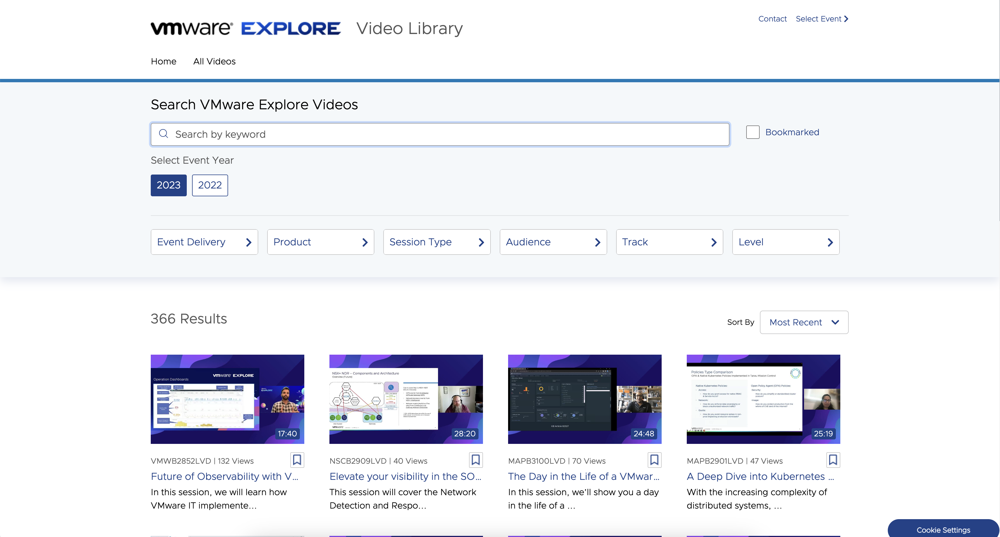
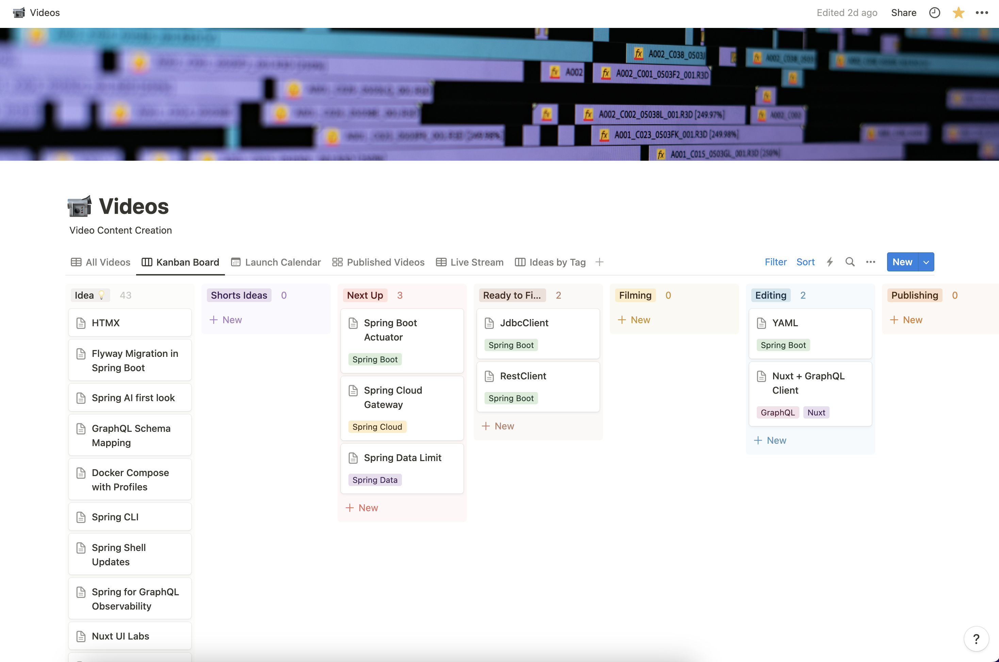

Happy Monday and welcome to another edition of the newsletter. It's Labor Day here in the United States, which marks the unofficial end of summer. It's always bittersweet for me. On one hand, it means the end of my favorite time here in the Midwest. I love being outside, grilling, having pool parties, and going for morning runs in my neighborhood. While those won't completely go away yet, they are coming to an end. On the other side of the holiday is fall, football, and the kids are back in school. To get me through the end of summer let me know what some of your favorite fall traditions are.

In this week's newsletter, we're going to talk about working with JSON in Java and Spring.

## JSON in Spring

Last week, I spent some time exploring how to work with JSON in Spring applications. I was inspired to dig into this topic by my desire to create a demo GraphQL API for a video project. I wanted to use real-world data for this API and decided to extract it from my personal blog, which uses GraphQL.

I wrote a query to extract the data, which resulted in some JSON data. However, the format of this data was not suitable for importing into my new application. To address this issue, I went down the rabbit hole of reading JSON files in Spring and exploring the various options available for mapping this data to the types used in my application.

`youtube:https://youtu.be/EumLbf8WjnY`

`youtube:https://youtu.be/cw0TfpcUkao`

## VMware Explore Recordings

In last week's newsletter, I talked about my trip to Las Vegas for SpringOne. This week, I'm happy to share the news that all of the breakout sessions have been uploaded to the [VMware Explore Library](https://www.vmware.com/explore/video-library/video-landing.html). To access the sessions, simply create a free account and log in. Two out of the three sessions I gave were recorded, and you can check them out below.

- [Does your API need a REST, checkout GraphQL](https://www.vmware.com/explore/video-library/video-landing.html?sessionid=1681495955926001D6RA&videoId=6335272726112).
- [Spring Recipes: Common problems and Solutions](https://www.vmware.com/explore/video-library/video-landing.html?sessionid=1680205167648001ZhTy&videoId=6335272438112)

I am still making my way through the recordings. I can’t believe how many great talks there are from both SpringOne and VMware Explore. If you were in attendance or had a chance to go through the library what are some of your must watch sessions?

## Upcoming Content

I have been hard at working on cleaning up my backlog of video ideas and planning out what is next. I have a couple videos already recorded and I’m looking forward editing and publishing those soon. This week my plan is to record videos on the new client in Spring Boot 3.2.

It’s hard to believe that I am starting to submit CFPs for next year. I submitted a bunch of talks to Code Mash, JFokus and I am working on my submissions for Devnexus. I spent some time last week updated my abstracts and you can [check them out here](https://github.com/danvega/abstracts). As a reminder you can always reach out to me if you would like me to speak at your user group meeting, lunch and learn or conference.

## Around the web

### 📝 Articles

- In this article Jens Schauder discusses the beginning of the end of the N+1 problem. This article walks through the problem and then introductions Single Query loading which can help us solve the problem. Just don’t call it SQL 🤣
- In this [next article](https://piotrminkowski.com/2023/08/29/introduction-to-grpc-with-spring-boot/), you will learn how to implement Spring Boot apps that communicate over gRPC. Piotr Minkowski shows us how to create a new project and a third party library that will help us support gRPC.

### 🎬 Videos

- The 2023 JVM Language Summit [replay records](https://www.youtube.com/watch?v=6nRS6UiN7X0&list=PLX8CzqL3ArzW90jKUCf4H6xCKpStxsOzp) are now hosted on the Java YouTube channel.
- I really enjoyed this video from a former coworker Matt Eland. In [this video](https://www.youtube.com/watch?v=2ULkQcOW8Y8) Matt walks us through his first look at GitHub Copilot Chat.

### 🎙 Podcasts

I discovered a new Podcast this week called [devtools.f](https://www.devtools.fm/episode/63)m. The episode I listened to featured Daniel Roe, Nuxt Core team lead. I really enjoyed this conversation about Daniel’s career and all things Nuxt.

### 👨🏼‍💻 Projects

It looks like [Nuxt Image is about to hit 1.0](https://twitter.com/nuxt_js/status/1696157897607061704) which is certainly exciting news.

## Until Next Week

I hope you enjoyed this newsletter installment, and I will talk to you in the next one. If you have any links you would like me to include please [contact me](http://twitter.com/therealdanvega) and I might add them to a future newsletter. I hope you have a great week and as always friends...

Happy Coding 
Dan Vega 
danvega@gmail.com 
[https://www.danvega.dev](https://www.danvega.dev)
