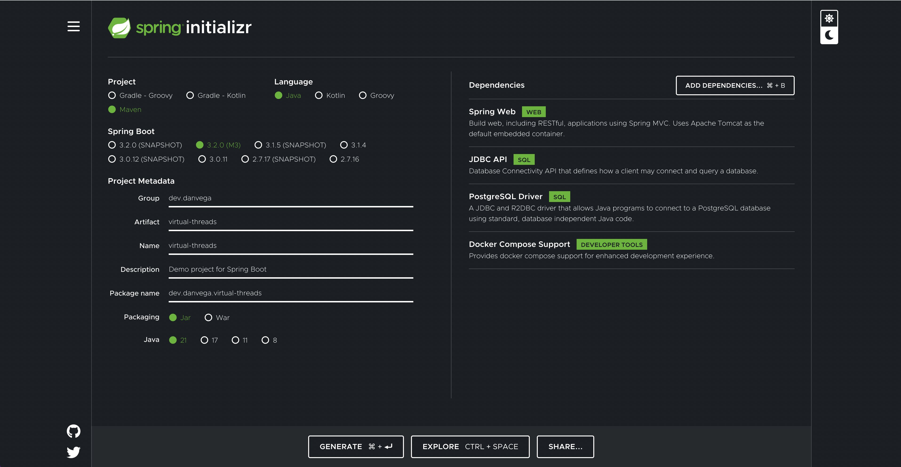

Happy Monday and welcome to another edition of the newsletter. Last week was busy as I engaged in activities I love, which I would like to share with all of you. It was an exciting week with the release of Java 21. I spent a lot of time tweeting and discussing this exciting release with all of you. Now that Java 21 is out, we can look forward to the release of Spring Boot 3.2 in November. This will allow us to start using Virtual Threads in production. In the meantime, you can already try out Spring Boot 3.2 Milestones and Java 21 for yourself!

## Spring Boot Code Structure

This is a tutorial I had in my backlog for a long time and I finally got around to making it. I decided to throw out a [tweet last week](https://twitter.com/therealdanvega/status/1704867889004564622) asking everyone how they structure code in their Spring Boot Applications. With over 120 comments I received a lot of really great feedback.

I created the following tutorial to walk through 2 ways that you can structure your code, Package by Layer and Package by Feature. I’m going to be diving into other architecture choices including tomorrow when I sit down with my friend [Ted Young on Spring Office Hours](https://tanzu.vmware.com/developer/tv/spring-office-hours/0053/) to talk about Hexagonal Architecture.

`youtube:https://youtu.be/B1d95I7-zsw`

## Java 21

Java 21 was released on Tuesday, and I spent most of the day consuming all the content I could. My friends at Oracle had an 8-hour release party on [dev.java](http://dev.java/), and I tried to watch as much as possible. If you missed it, you can check out the recording and catch up on all the exciting news about this release.

I decided to create a quick tutorial on how to get started with Java 21. In this video, I also discuss the JEPs included in this release and how to use preview features. I'm a big fan of Java 21 and plan to create a lot of content about it in the coming months.

`youtube:https://youtu.be/aqc5YB7TISM`

## Spring Boot Observability

I have been giving talks all over about Spring Boot 3 and beyond. One of the topics I cover is the complete revamp of Observability in Spring Boot 3, marking the beginning of a new Observability story.

In the last newsletter, I introduced [Spring Boot Actuator](https://youtu.be/4OVe0MWgZ4k), which sets the stage for this tutorial. In this tutorial, we delve deeper into the Actuator by exploring the metrics endpoint.

Through this tutorial, you will learn how to enable observability in your applications by including the Spring Boot Actuator. Additionally, you will discover how to view traces using a tool like Zipkin, and finally, how to utilize the Observation API and create your own observations.

`youtube:https://youtu.be/exRkiVLyPpc`

## Java Brains Podcast

There are some really great educators in the Java space and I was lucky enough to spend some time last week with one of my favorite content creators Kouth AKA Java Brains. We sat down and recorded an episode of his podcast and wow did I have some fun. I think we ended up talking for close to 90 minutes and probably could have spent the rest of the day talking.

`youtube:https://youtu.be/HTS8Yfos-Ns`

## SpringOne Tour Virtual

We’re still buzzing from the amazing energy at SpringOne at VMware Explore. If you made it out to Las Vegas, we were thrilled to have you be a part of the vibrant Spring developer community. If you weren’t able to make the event, there are still opportunities to learn from industry experts and connect.

The first stop on our SpringOne Tour is a virtual session where we’ll be featuring the latest advancements, best practices, and tools and techniques that are quickly becoming industry-standard. Our technical advocates, Spring engineers, and application development experts will bring you an in-depth look into the beauty of open source, with Spring Framework, Spring Boot 3, Kubernetes, Progressive Delivery and more, so you can innovate faster.

Join us virtually on October 17, 2023 by [registering for free using this link](https://springonetour.io/).

## Around the web

### 📝 Articles

Shortly after Java 21 was released GraalVM for JDK 21 was released. I enjoyed [this article](https://medium.com/graalvm/graalvm-for-jdk-21-is-here-ee01177dd12d) by Alina Yurenko and was particularly intrigued by the section that talked about the speed of JIT vs AOT.

### 🎬 Videos

I really enjoyed [this documentary on TypeScript](https://www.youtube.com/watch?v=U6s2pdxebSo&t=4386s&pp=ygUWdHlwZXNjcmlwdCBkb2N1bWVudGFyeQ%3D%3D). It was really great to hear behind the scenes stories of how they got started with it Microsoft and how they used it to build VS Code. I’m a big fan of TypeScript and It got me excited to find a way to use it more.

### 🎙 Podcasts

I really enjoyed [this episode of the Bootiful Podcast](https://bootifulpodcast.fm/#/episodes/16aff4f7-4a2f-4823-ac21-b9fbf15bd914) with Sharat Chander. In this episode 2 legends (and friends of mine) sit down to talk about past, present and future of Java.

### ✍️ Quote of the week

****“Instead of worrying about what you cannot control, shift your energy to what you can create.” – Roy T. Bennett****

## Until Next Week

I hope you enjoyed this newsletter installment, and I will talk to you in the next one. If you have any links you would like me to include please [contact me](http://twitter.com/therealdanvega) and I might add them to a future newsletter. I hope you have a great week and as always friends...

Happy Coding 
Dan Vega 
danvega@gmail.com 
[https://www.danvega.dev](https://www.danvega.dev)
