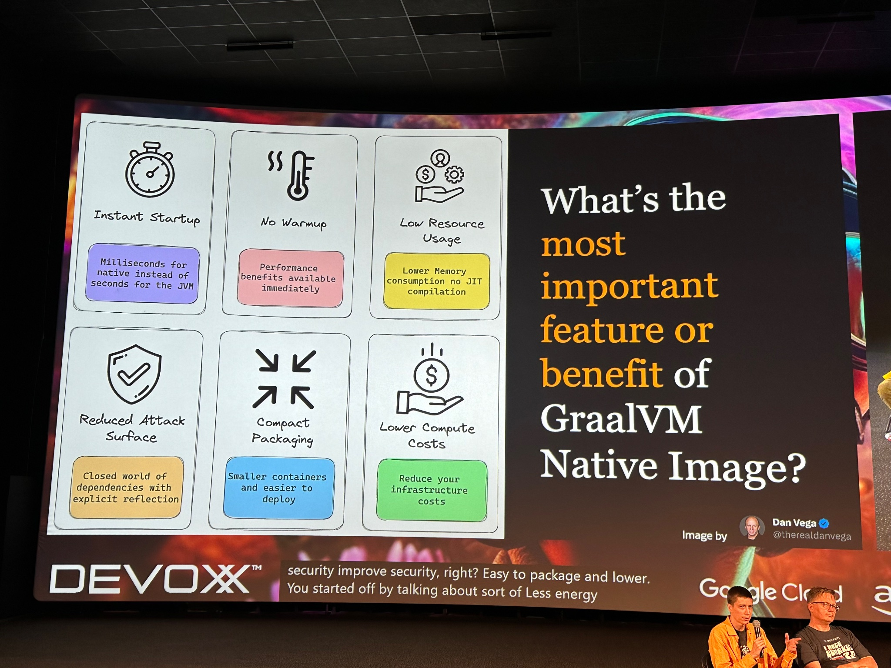

Happy Monday and welcome to another edition of the newsletter. I’m in the middle of a pretty stressful month some of which I won’t get into here but If I’m being honest I’m struggling a bit but I am doing my best to push forward. I have a bunch of presentations at upcoming events I’m preparing for and I couldn't be more excited about all of them.

In this episode I want to talk to you about testing Spring Boot applications, Spring Cloud Gateway and more.

## Testing Spring Boot Applications

I recently had a discussion about testing Spring Boot applications during [Spring Office Hours](https://www.youtube.com/watch?v=PdXcInQ1SjA) with DaShaun. One aspect of Spring Boot that I particularly appreciate is that testing is built-in and doesn't require any additional setup.

When you create a new project on [start.spring.io](http://start.spring.io/), the `spring-boot-starter-test` is automatically included in your application. In the mentioned episode and the video provided below, I explain what is included in this starter. Understanding the components that come with Spring Boot makes it easier to comprehend the purpose of tests and the resources available to you for writing them.

`youtube:https://youtu.be/rUbjV3VY1DI`

I'm also a big fan of Testcontainers and how it simplifies the process of doing the right thing. We all understand the importance of writing tests, but if integration tests take too long, we are less motivated to write them. In this tutorial, I will guide you on how to get started with Testcontainers in Spring Boot. Additionally, we will explore how the changes in Spring Boot 3.1 make this process even easier.

`youtube:https://youtu.be/erp-7MCK5BU`

## Spring Cloud Gateway

Spring Cloud Gateway is a topic I have wanted to create a tutorial on for ahwile now and last week I finally got around to doing it. I’m building out a service called DanSON Placeholder Service (yes, just like JSON Placeholder Service) and I thought this would be a really good way to show off an API Gateway and specifically Spring Cloud Gateway.

`youtube:https://youtu.be/EKoq98KqvrI`

I put together this graphic and I used it during my tutorial. I thought I would share it here in case you find useful.

This was an introduction to Spring Cloud Gateway, but it is certainly not the end of this series. I asked you guys on Twitter if you had any questions about API Gateways or SCG, and you came up with some really great questions. Here is a list of those questions, and we still need to answer the majority of them.

- Does it make sense to have a Gateway when deploying on Kubernetes or any other orchestration with some sort of service discovery?
- The company I work for runs Spring Boot services within a Kubernetes cluster. My question is: Is it better to use Ingress (nginx) or Spring Cloud Gateway to route user requests? Thanks.
- Do Virtual Threads make any difference? Does a non-Project Reactor implementation exist that can use Virtual Threads?
- SCG --> Kafka would be exciting
- Hi Dan, can Spring Cloud Gateway be integrated with Microservices written in languages other than Java? Thx
- Can you compare it with other similar tools like Envoy?
- I would love for you to do a tutorial on this and how it links up to event-driven architecture
- Do you need to scale SCG because of the services behind it? Imagine I need to scale one of the services that has very high throughput, does SCG need to scale as well? Otherwise, would it be a bottleneck?
- I've always wanted to leverage Spring Cloud Gateway to build something that validates against an OpenAPI spec and logs req+res with tags on the operations in the OpenAPI spec.
- What are the differences between Spring Cloud Gateway and Netflix Zuul?
- Is it okay to have Spring Cloud Gateway along with microservices as a single repository and single service?
- Integrate role-based access control with API gateway microservice architecture
- How to implement audit logs in SCG?
- Yes, what would be the best way to document my gateway API with OpenAPI? It becomes complicated to implement this so that it works accepting requests from Swagger and from external clients (Postman).
- SCG is great, but I always had a bit of trouble distinguishing the various OAuth2 flows. Resource Server, M2M, browser flow, etc. Some worked examples would be nice.
- Can you spare some thoughts on Inter Web-Services on Microservices design with a few examples?
- Would be awesome if you can implement JWT using spring security on API gateway.
- Open API
- Should you pass JWT token to a microservice, or you can verify it on Gateway and just made a non-secured request to an endpoint?

## Devoxx

Devoxx Belgium took place last week, and I experienced some serious FOMO while watching all the buzz surrounding the conference. It was really cool to see the GraalVM Native Image panel discussion, especially since they used one of my tweets as a talking point. I want to express my gratitude to [Thomas Vitale](https://twitter.com/vitalethomas/status/1709563387267387581/photo/1) for bringing this to my attention.

I was impressed by the quickness with which they posted the conference recordings on their [YouTube channel](https://www.youtube.com/@DevoxxForever). There is a lengthy list of talks that I am interested in watching, but I intend to save them for my trip to Barcelona next month.

## Upcoming Conferences

This is going to be a busy few months to wrap up the year. Not only do I have everything that’s going on below but I also have bunch of in-person customer meetings that I am really looking forward. I will be [speaking](https://www.danvega.dev/speaking) at the following conferences so if you are in attendance please come say hi 👋🏻

- [Connect Tech](https://2023.connect.tech/) - October 24-26 2023
- [VMware Barcelona](https://www.vmware.com/explore/eu.html) - November 6-9 2023
- [CodeMash](https://codemash.org/) - January 9-12 2024

### SpringOne Tour Virtual

We’re still buzzing from the amazing energy at SpringOne at VMware Explore. If you made it out to Las Vegas, we were thrilled to have you be a part of the vibrant Spring developer community. If you weren’t able to make the event, there are still opportunities to learn from industry experts and connect.

The first stop on our SpringOne Tour is a virtual session where we’ll be featuring the latest advancements, best practices, and tools and techniques that are quickly becoming industry-standard. Our technical advocates, Spring engineers, and application development experts will bring you an in-depth look into the beauty of open source, with Spring Framework, Spring Boot 3, Kubernetes, Progressive Delivery and more, so you can innovate faster.

Join us virtually on October 17, 2023 by [registering for free using this link](https://springonetour.io/).

## Around the web

### 📝 Articles

- I really enjoyed [this article](https://glaforge.dev/posts/2023/10/02/client-side-consumption-of-a-rate-limited-api-in-java/) by Guillaume Laforge where he discusses client-side consumption of rate-limited APIs in Java. Guillaume walks us through how rate limiting works and some libraries in Java that can help us with that such as Bucket4J and Resilience4J.
- There is a really [good article](https://auth0.com/blog/how-to-build-a-graphql-api-with-spring-boot/) on the Auth0 blog  by Jimena Garbarino on How to build a GraphQL API with Spring Boot. This is a complete walkthrough of building a GraphQL API in Spring and consuming it in React with Next.js

### 🎬 Videos

I really enjoyed this video by my friend and coworker Josh Long. In this tutorial Josh talks about how different it is to get started with Java today as opposed to when he started. He walks through some of the tooling in the Java ecosystem and how to get started.

### ✍️ Quote of the week

> “Work harder on yourself than you do on your job.” – Jim Rohn

### 🐦 Tweet

I had testing on my mind last week and decided to put a quick Twitter poll together to see what Assertion library Java users were using and here are the results.

[https://twitter.com/therealdanvega/status/1710041316703219883](https://twitter.com/therealdanvega/status/1710041316703219883)

## Until Next Week

I hope you enjoyed this newsletter installment, and I will talk to you in the next one. If you have any links you would like me to include please [contact me](http://twitter.com/therealdanvega) and I might add them to a future newsletter. I hope you have a great week and as always friends...

Happy Coding 
Dan Vega 
danvega@gmail.com 
[https://www.danvega.dev](https://www.danvega.dev)
