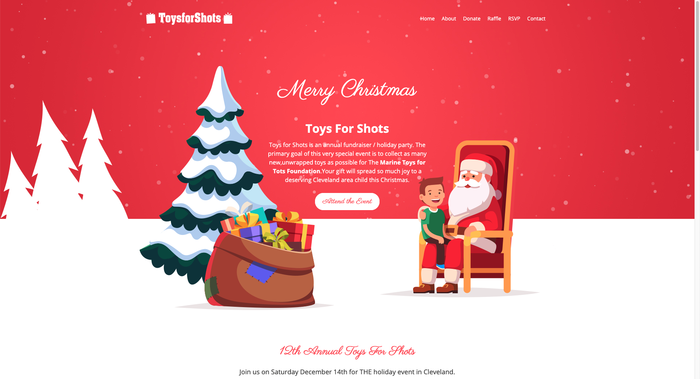

Welcome to Coffee and Code with me, Dan Vega. This newsletter is a little insight into what I was up to this week, things I found interesting and anything on my radar for the upcoming week.  If you missed last week's newsletter you can checkout Coffee and Code #12 [here](https://www.danvega.dev/newsletter/coffee-and-code/12). If you don't already have a cup of coffee grab one now and let's get to it.

## Previous Week

If you didn't already know I am the President of a non-profit in Cleveland OH called CLE Cares. Every December we partner with the Marines Toys for Tots Foundation to raise toys for those less fortunate right here in Northeast Ohio. We throw a big event called Toys for Shots and the idea is simple, you bring us a toy and we will give you some drinks.

I was looking at the current website this year and it was getting kind of stale. With not a lot of time on my hands, I decided to purchase a template and use that to update our website. The template was great but it was for a single page site and I really wanted to have multiple pages so even using a template took me some time to strip it down to just want I wanted which was essentially the home page graphics. I have this [hosted on Netlify](https://toysforshots.netlify.com/) and I am still tweaking some things but I would love your feedback.

### VueConf US

The [VueConf US](https://us.vuejs.org/) call for papers deadline was this week and as always I was a master at procrastination waiting until the very last minute to submit a few talks. If you want to read the full descriptions of my submissions they are available for this conference and every other conference I submit to [over on my Github](https://github.com/danvega/call-for-papers). These are the talks I ended up submitting:

- Vue 3.0 Better, Faster & Stronger
- A beginners guide to testing in Vue.js
- Moving my blog from WordPress to Gridsome
- Serverless and Vue

### Meetup

The other big news of the week was Meetups' [announcement of pricing changes](https://www.meetup.com/lp/paymentchanges?mpId=9038). The proposed change would charge each attendee $2 to RSVP for a meetup or the organizers could pick up that bill. As someone who runs a meetup I had a lot of problems with this and apparently so did everyone else in the community.

It was really great to see freeCodeCamp announce that they were going to build an alternative to Meetup called Chapter. If you want to learn more about this project you can check out their [Github repo](https://github.com/freeCodeCamp/chapter). Finally, if you're looking for alternatives to Meetup I found this [really great article by Nicolas Goutay](https://phacks.dev/meetup-com-alternatives) where he discusses some options that he found.

## Around the Web

These are things I found cool around the web this week.

### Articles

- [Too Hard, Too Soft, Just Right - Rendering HTML with lit-html](https://dev.to/azure/too-hard-too-soft-just-right-rendering-html-with-lit-html-1km8)
- [How to integrate Infinite Loading with Gridsome](https://gridsome.org/blog/2019/10/08/infinite-loading-with-gridsome/)
- [Focus on the process: stop thinking and start doing](https://nesslabs.com/focus-on-the-process)
- [Creating and using your first Netlify Build Plugin](https://www.netlify.com/blog/2019/10/16/creating-and-using-your-first-netlify-build-plugin/)

### Videos

- [Opening Keynote (Firebase Summit 2019)](https://www.youtube.com/watch?v=wO70Pnv0yeo&)
- [Mozilla Developer](https://www.youtube.com/channel/UCh5UlGiu9d6LegIeUCW4N1w/videos)
- [Spring One Conference Recordings](https://www.youtube.com/user/goPivotal/videos)
- [Netlify Tutorial - How to build and deploy websites using Netlify](https://www.youtube.com/watch?v=mT5siI19gtc)

### Podcasts

- [Go Time: Creating the Go programming language](https://changelog.com/news/bWR9/visit)
- [Go Time: Serverless and Go](https://changelog.com/news/V2A1/visit)

### Books

- [The Go Programming Language](https://learning.oreilly.com/library/view/the-go-programming/9780134190570/)

### Projects

- [GitSheet](https://gitsheet.wtf/)
- [SQL Murder Mystery](http://mystery.knightlab.com/)
- [Flickity - Touch, responsive, flickable carousels](https://flickity.metafizzy.co/)
- [Mssql extension for Visual Studio Code](https://cloudblogs.microsoft.com/sqlserver/2019/10/17/mssql-extension-for-visual-studio-code-now-has-object-explorer-and-intellicode/)

### Newsletters

- [Groovy Calamari](http://groovycalamari.com/issues/167?#start)

### Follow This Person

I have a been a huge fan of everything Adam Wathan does from his course on Advanced Vue Component Design to his podcast and now his work on Tailwind CSS. Adam is a software developer, entrepreneur, podcaster, educator and so much more. If you're not following Adam over on Twitter he is my must follow of the week.

[https://twitter.com/adamwathan](https://twitter.com/adamwathan)

## Until Next Week

Thanks for sitting down and sharing a cup of coffee with me my friend. I hope you enjoyed this installment of Coffee & Code and I will see you next Sunday morning. If you have any links you would like me to include please contact me and I might add them to a future newsletter. I hope you have a great week and as always friends...

Happy Coding 
Dan Vega 
danvega@gmail.com 
[https://www.danvega.dev](https://www.danvega.dev/)
