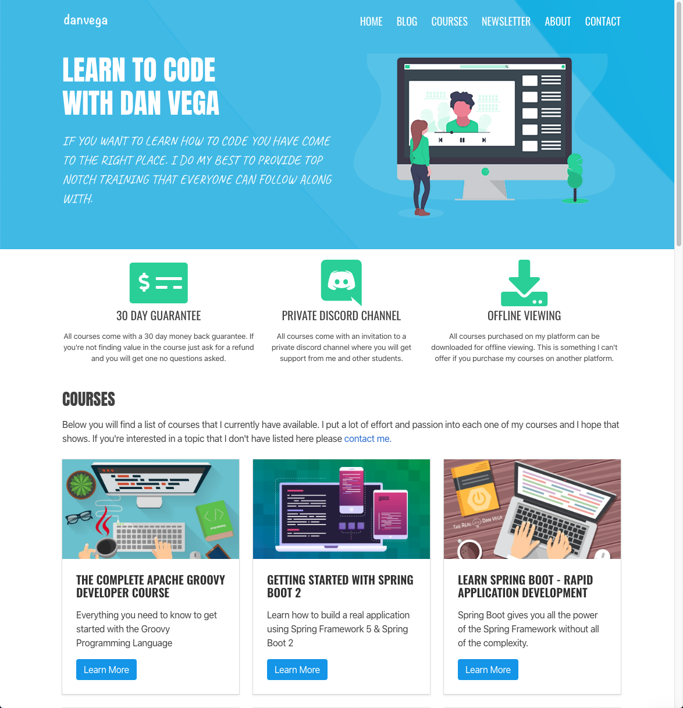

Welcome to Coffee and Code with me, Dan Vega. This newsletter is a little insight into what I was up to this week, things I found interesting and anything on my radar for the upcoming week. If you missed last week's newsletter you can checkout Coffee and Code #13 [here](https://www.danvega.dev/newsletter/coffee-and-code/13). If you don't already have a cup of coffee grab one now and let's get to it.

## Previous Week

I spent a lot of my free time this week working on my website. One of the first things I did was upgrade [Gridsome to 0.7.x](https://gridsome.org/blog/2019/09/17/gridsome-v07/) and it's something I have been meaning to get around to for a while. With this upgrade, there were a few things I had to do. The big one was moving any route definitions (which is being deprecated) into a new feature called [template configurations](https://gridsome.org/blog/2019/09/17/gridsome-v07/#new-template-configuration).

    templates: {
      Post: "/blog/:year/:month/:day/:slug",
      Tag: "/tag/:title",
      Newsletter: "/newsletter/coffee-and-code/:issue"
    },

With that in place, I wanted to add a [newsletter landing page](https://www.danvega.dev/newsletter) where I could send people to sign up for the newsletter. I also created a nice [thank you page](https://www.danvega.dev/newsletter/thank-you/) for subscribers after they signed up letting them know that the next issue of the newsletter will come out this Sunday along with some links to the last 3 issues. Finally, I created [an archives page](https://www.danvega.dev/newsletter/archives/) that I don't really link to anywhere but I thought I would give that to all of you in case you wanted it.

I also put together a quick landing page that shows off all of my [current and upcoming courses](https://www.danvega.dev/courses). I would like to have individual landing pages for each of my courses but that is going to come with time. I am not the greatest designer but I am happy with it knowing that these are projects I hope to have money to pay a professional to do later down the road.

If you weren't aware all of the source code for my personal website is up on [Github](https://github.com/danvega/danvega-dev) if you're interested in checking it out.

### Vuetify

I was able to use [Vuetify](https://vuetifyjs.com/en/) in a project at work this week and I have to say I was impressed. I am someone who cares about how an application looks but often doesn't have the time or skill to create them. I really appreciate just how easy it is to install, use and customize. The number of components that come out of the box is very impressive and they have pretty much everything you need to build beautiful and functional applications. This is not a paid sponsorship, I am just truly impressed with the project so if you have a chance I would check them out.

## Around the Web

These are things I found cool around the web this week.

### Articles

- [What nobody tells you about documentation](https://www.divio.com/blog/documentation/)
- [Java 9 to Java 13 - Top features](https://dev.to/therajsaxena/java-9-to-java-13-top-features-362l)

### Videos

- [AWS Certified Cloud Practitioner Training 2019 - Full Course](https://www.youtube.com/watch?v=3hLmDS179YE)

### Podcasts

- [VoV 084: Nuxt.JS With Sebastien Chopin](https://devchat.tv/views-on-vue/vov-084-nuxt-js-with-sebastien-chopin/)
- [Go Time: Building search tools in Go](https://changelog.com/gotime/104)

### Projects

- [Vuetify](https://vuetifyjs.com/en/)
- [Firefox 70](https://hacks.mozilla.org/2019/10/firefox-70-a-bountiful-release-for-all/)
- [#16 - Daniel Vassallo - Why I Left a \$500k/year Job at AWS to Work For Myself](https://www.ecpodcast.io/episodes/16-daniel-vassallo-why-i-quit-a-500k-job-at-amazon-to-work-for-myself)

### Follow This Person

I have been working a lot lately with Adam Jahr of Vue Mastery and it's been an absolute pleasure. When you have a chance to work with people who are passionate about what they do it makes work not feel like work. Adam is a great teacher and what he and his team over at Vue Mastery is doing is pretty darn impressive. Adam is my must follow of the week!

[https://twitter.com/AdamJahr](https://twitter.com/AdamJahr)

## Until Next Week

Thanks for sitting down and sharing a cup of coffee with me my friend. I hope you enjoyed this installment of Coffee & Code and I will see you next Sunday morning. If you have any links you would like me to include please contact me and I might add them to a future newsletter. I hope you have a great week and as always friends...

Happy Coding 
Dan Vega
