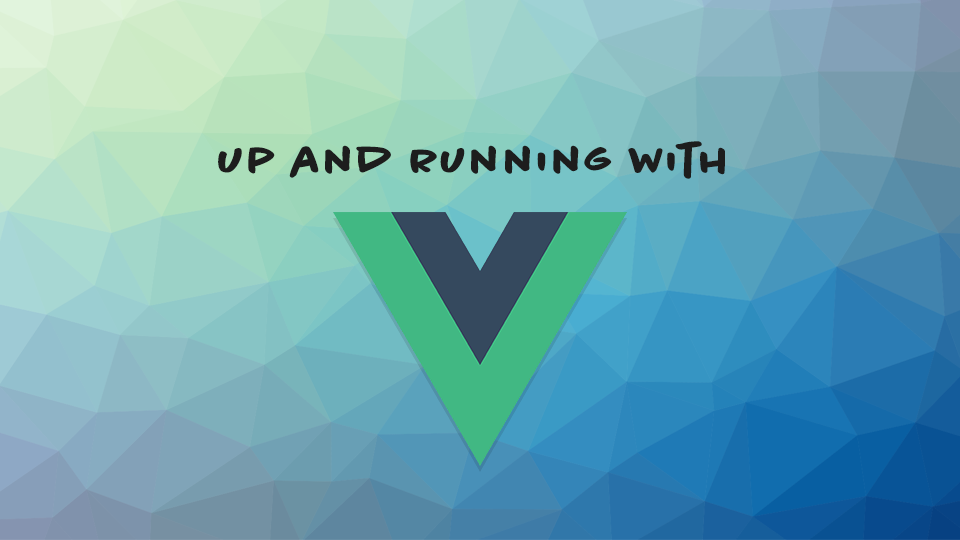

Welcome to Coffee and Code with me, Dan Vega. This newsletter is a little insight into what I was up to this week, things I found interesting and anything on my radar for the upcoming week. If you missed last week's newsletter you can checkout Coffee and Code #15 [here](https://www.danvega.dev/newsletter/coffee-and-code/15). If you don't already have a cup of coffee grab one now and let's get to it.

## Previous Week

It was a busy week for me (when is it not these days) as I was able to release a new video on YouTube and wrap up step one of my new course.

## Up and Running with VueJS

This week I completed the free lessons for my next course "Up and Running with VueJS". My original plan was to release these as a teaser to the full paid course but I have been going back and forth with a couple of different ideas. This is what the first six lessons in the course look like.

**Welcome**
In this lesson, I will give you a quick introduction to the course. We will discuss what you can expect to learn in the course along with what the prerequisites for taking this course are and what hardware and software are required.

**What is Vue**

In this lesson, I will give you a quick introduction to what Vue is. We will also go into a little bit of a discussion on selecting the right JavaScript framework for you.

**Why Vue**
Now that you know what Vue is it would be helpful to understand why you should use Vue. There are a lot of really great libraries and frameworks out there, so why choose Vue? If you haven't already guessed Vue is my favorite framework and I have some reasons that I think it's really great for everyone of all skill levels but especially beginners.

**Moving from jQuery to Vue**
It was jQuery that really got me interested in JavaScript (again). I think it was just how easy jQuery made everything. You could just drop in a script tag on a page and start adding some pretty cool features without knowing much. I look at Vue the same way and in this lesson, I will discuss how you can move from jQuery to Vue.

**Hello, Vue**

No introduction to a language or framework would be complete without the quintessential Hello, World! In this lesson, we will drop a script tag on to a blank page and walk through every line of code that it takes to create a Hello, World. Spoiler alert: It isn't much!

**Resources & Next Steps**
Have I scratched an itch? Do you want to learn more? I am going to give you a going-away present with a list of resources that I find are very helpful when trying to learn Vue. I will, of course, point you to the continuation of this course which will be coming out soon!

### Up & Running with Vue Free Lessons

If you're interested in watching these lessons you can check them out using the link below. Please understand this is a really rough draft of the course and has no pretty landing pages associated with it. Also, if you have a minute I would really appreciate some feedback on the course. Feel free to reach out to me on [Twitter](https://twitter.com/therealdanvega) or send me an [email](mailto:danvega@gmail.com).

[Get the FREE Course Here](https://therealdanvega.teachable.com/purchase?product_id=1436764)

## Create Spring Boot Applications in Visual Studio Code

I was able to [post a new video on YouTube](https://www.youtube.com/watch?v=5mpHejytgFE](https://www.youtube.com/watch?v=5mpHejytgFE)) this week. I thought it would be cool to show how you could create a new Spring Boot Project (using the Spring Initializr) right in Visual Studio Code. I'm a huge fan of IntelliJ and still purchase a personal license for myself and I won't be giving that up anytime soon.

That being said I do find myself working on projects that are both frontend (Vue) and backend (Spring Boot) and in those situations I am just more comfortable in Visual Studio Code. In this tutorial I create a new Spring Boot Project and Vue Project in VS Code and have the two talk to each other. It's a pretty trivial example but I think it's a great introduction.

## Around the Web

These are things I found cool around the web this week.

### Articles

- [Loading dynamic images in a Vue Component](https://dev.to/firstclown/loading-dynamic-images-in-a-vue-component-50k7)
- [Own Your Content, Broaden Your Audience](https://www.stackbit.com/blog/devto-stackbit/)
- [Special Announcement From the DEV Founders](https://dev.to/devteam/special-announcement-from-the-dev-founders-hel)
- [Azure Spring Cloud service is now in private preview](https://azure.microsoft.com/en-us/updates/azure-spring-cloud-service-is-now-in-private-preview/)

### Videos

- [Quill is the company about to take on Slack](https://www.youtube.com/watch?v=JG1xINOkBoY)
- [Teachable Machine 1: Image Classification](https://youtu.be/kwcillcWOg0)
- [What's New in Premiere Pro 2020 v14.0](https://youtu.be/J5rruXYkFuo)
- [Building an Inbox UI with Tailwind CSS](https://www.youtube.com/watch?v=6xgMkGMIudE)

### Podcasts

- [defMode.fm: How, when, and why to use the JAMstack](https://devmode.fm/episodes/how-when-and-why-to-use-the-jamstack)

### Projects

- [Visual Studio Online](https://visualstudio.microsoft.com/services/visual-studio-online/)
- [Announcing TypeScript 3.7](https://devblogs.microsoft.com/typescript/announcing-typescript-3-7/)
- [Postwoman API request builder](https://dev.to/liyasthomas/i-created-postwoman-an-online-open-source-api-request-builder-41md)

### Courses

- [Mastering ConvertKit](https://doubleyourfreelancing.com/mastering-convertkit)

### Conferences

I am very jealous of anyone attending VueConf Toronto this week and I can't wait to see some pictures and recordings from the conference.

[https://vuetoronto.com/](https://vuetoronto.com/)

### Follow This Person

This week must follow is [Gusto](https://twitter.com/gustojs) who is a VueJS core team member and the administrator of the [VueLand Discord](https://t.co/Nfb5gWGlfU?amp=1). Gusto is very involved in the Vue community and I always enjoy the content that he continues to put out.

## Until Next Week

Thanks for sitting down and sharing a cup of coffee with me my friend. I hope you enjoyed this installment of Coffee & Code and I will see you next Sunday morning. If you have any links you would like me to include please contact me and I might add them to a future newsletter. I hope you have a great week and as always friends...

Happy Coding 
Dan Vega 
danvega@gmail.com 
[https://www.danvega.dev](https://www.danvega.dev/)
